# Redesign Round 3 — Deep Research (literature-grounded)

> Round 3 of a four-round research process. Submitted to GPT Deep Research
> externally on 2026-05-19 against the prompt at
> `docs/calibration/redesign-round-3-prompt.md`. Citation markers preserved
> verbatim from the source — they reference an internal citation tree that
> isn't rendered here but doesn't affect the substance.

---

## Ground-Up Redesign for EA NHL Pro Clubs Video OCR

## Executive summary

Your brief describes a pipeline that has to extract a very large, heterogeneous inventory of game-derived statistics from recorded EA NHL Pro Clubs videos, with no reliable API ground truth for most fields, no test-time human review, a low annual volume, and an annual UI redesign risk. It also describes an apparent taxonomy inconsistency: the text says there are "8 distinct on-screen screen types," but the enumerated inventory contains 10 extraction targets if the in-game HUD and the various post-game views are each treated as distinct schemas. In this report, I treat the enumerated inventory as the authoritative scope and assume the real task is to support a small number of recurring screen families with roughly 10 schema variants and 600+ per-match fields.

My main conclusion is that this should **not** be redesigned as "a better OCR pipeline" in the narrow sense. It should be redesigned as a **stateful screen-understanding system with typed extractors, probabilistic evidence aggregation, and an integrated truth system**. The strongest literature-backed pattern for this kind of problem is not a monolithic end-to-end video model, and not a naïve "OCR every frame" approach. It is a **hybrid**: cheap video probing to find stable states and transitions, temporal smoothing over those states, extraction from a small number of high-quality frames for stable screens, a separate full-rate branch for the in-game HUD, and downstream fusion that keeps confidence, alternatives, and consistency constraints instead of collapsing to a single early OCR guess. That conclusion is supported by production OCR systems, video OCR literature on multi-frame integration, video frame-selection work, and recent evidence that current multimodal video models still struggle on cross-frame OCR-heavy tasks.

In practical terms, I recommend a **three-layer redesign**. First, use a **probe-and-segment layer**: low-cost frame probing, anchor detection, and a small HMM/Viterbi state model to produce legal screen sequences. Second, use a **typed extraction layer**: ROI-based crops anchored to versioned screen templates, with different extractors for open text, closed-vocabulary labels, tabular numerics, icons, and coordinate-bearing chart markers. Third, use an **evidence and promotion layer**: each field emits n-best hypotheses, calibrated confidence, frame provenance, and observability status, and promotion happens only after temporal and cross-screen consistency checks. This is my synthesis, but it is constructed directly from cited work on HMM-style temporal decoding, CTC/probabilistic OCR, multi-frame voting, frame-quality selection, and two-stage OCR architectures deployed at scale.

I do **not** recommend making a general-purpose VLM the production extractor. OCR-free document models such as Donut, Pix2Struct, and ScreenAI are valuable as calibration and tooling aids, and large multimodal models are useful as offline adjudicators or label bootstrappers. But the evidence base does not support using them as the sole runtime path for a 98% per-field target on numerically dense, cross-frame, UI-drifting extraction. Static-image benchmarks show they are promising readers; video-OCR benchmarks show that they remain fragile on cross-frame integration, spatiotemporal OCR, and visually plausible but incorrect text outputs.

The second major conclusion is that your **truth system is part of the product**, not an external audit layer. At your error target, you cannot rely only on a single fully keyed benchmark match and downstream completeness checks. You need a tiered truth architecture: a small gold set of fully keyed matches per UI generation, a much larger silver set built from weak supervision and invariants, and an active-learning loop that asks for annotation only on maximally informative crops, rows, or segments rather than entire matches. That recommendation is grounded in weak-supervision work such as Snorkel and MeTaL, OCR work combining voting with active learning, and low-label scene-text recognition literature.

Finally, the redesign should explicitly separate **pipeline error** from **source-video observability error**. Your own brief already shows that unattended ingest on match 463 was capped by recording gaps rather than pure OCR defects. A robust architecture therefore needs a first-class `not_observable_from_source` state, with evidence showing that required screens were absent, too brief, occluded, or too low quality. Without that distinction, field accuracy metrics will be polluted by unfixable failures, and the system will be pushed toward silent hallucination rather than calibrated abstention.

## Architecture survey

The literature points to a small set of recurring architectural patterns for structured extraction from video. The table below summarizes the patterns most relevant to your pipeline and how they trade off under your constraints.

| Pattern                                          | Architectural idea                                                                                         | Strengths                                                                                       | Weaknesses                                                                                                                   | Best reading of the literature for your use case                                                                                                                                                                                                   |
| ------------------------------------------------ | ---------------------------------------------------------------------------------------------------------- | ----------------------------------------------------------------------------------------------- | ---------------------------------------------------------------------------------------------------------------------------- | -------------------------------------------------------------------------------------------------------------------------------------------------------------------------------------------------------------------------------------------------- |
| Single-pass continuous extraction                | Run one model or one extractor stack over all frames continuously                                          | Conceptually simple; easy to reason about if the target is truly frame-dense                    | Wastes compute on redundant stable frames; difficult to use observability logic; brittle when screens have different schemas | Poor fit for most of your inventory, except the gameplay HUD branch. Meta explicitly notes that the naïve "apply image OCR to every video frame" approach is not scalable, and recent video-OCR work reinforces the need for temporal selectivity. |
| Two-pass probe plus dense extraction             | First detect where states/segments are, then extract only in relevant windows                              | Widely used, compute-efficient, easier to debug, aligns well with screen-specific parsers       | Segmenter quality becomes critical; can miss short states if the probe is too weak                                           | Strong baseline pattern. It matches production OCR practice and sports/video literature better than monolithic processing.                                                                                                                         |
| Event-driven transition detect plus extract-once | Detect transitions into a stable state, then choose best frame(s) rather than OCR every frame in the state | Lowest redundant compute; often best for stable UI screens and document-like pages              | Requires good transition detection and frame-quality scoring; not enough for continuously changing HUDs                      | Best fit for the loadout, summary, box score, event list, faceoff map, and net-chart screens. Video document capture and older video OCR work both support best-frame selection and multi-frame integration.                                       |
| HMM/Viterbi or CRF temporal decoding             | Per-frame state probabilities are smoothed into a legal sequence with transition priors                    | Converts noisy frame classifications into legal screen paths; handles brief corrupt frames well | Requires a state graph and transition priors; CRFs add implementation complexity                                             | Strong fit. Your state space is small and structured, so HMM/Viterbi gives most of the value with less complexity than a CRF-heavy design.                                                                                                         |
| Hard-decision OCR                                | OCR returns one final string, downstream regex decides if it worked                                        | Easy to implement                                                                               | Throws away uncertainty and alternate decodes early; hard to fuse across frames                                              | Weak fit for your target accuracy. Modern OCR is fundamentally probabilistic, and recent work shows confidence calibration matters.                                                                                                                |
| Probabilistic OCR with n-best/confidence         | OCR retains beam alternatives, confidence, or calibrated posteriors                                        | Enables multi-frame voting, constrained decoding, abstention, and error detection               | More engineering work; needs calibration                                                                                     | Strong fit. This is one of the highest-value changes relative to your current design.                                                                                                                                                              |
| OCR-free document AI                             | End-to-end screenshot or document model emits structure directly                                           | Elegant, excellent for forms and UI-like tasks, useful for calibration tooling                  | Numerically brittle on dense layouts; expensive to adapt; not video-native                                                   | Useful as an auxiliary tool, not as the primary production extractor.                                                                                                                                                                              |
| General multimodal VLMs                          | Prompt a large multimodal model to read screenshots or videos and emit structure                           | Flexible, good zero-shot coverage, useful for label bootstrapping and schema discovery          | Hallucinations; closed internals; weak guarantees on tiny numerics and cross-frame fusion; higher cost/latency               | Valuable offline and for adjudication, but the evidence does not support making them your only runtime path.                                                                                                                                       |

The extraction-pattern literature strongly favors a **hybrid of probing, temporal selection, and multi-frame integration** for problems where text-bearing states persist across several frames. Older video OCR work showed that multiple-frame integration improves recognition under low resolution and background complexity, while later sports-video work used scoreboard localization plus multi-frame voting to improve OCR rates. Document-video capture work independently reached a similar conclusion: using video is effective when the system can detect transitions and pick the best stills rather than treating every frame as equally useful. Production writeups from Meta reach the same operational conclusion from the opposite scale direction: frame selection matters because running image OCR on every video frame is wasteful.

For temporal segmentation, the literature is mature even if it is not written specifically about sports-game HUDs. HMMs and CRFs are standard tools for noisy sequence labeling because they impose legal transitions and exploit temporal persistence. Rabiner remains the canonical reference for HMM/Viterbi inference, and CRFs generalize the idea when richer contextual features matter. In video segmentation specifically, HMM-based scene segmentation and multimodal CRF segmentation have long been used to regularize noisy local predictions. For your pipeline, the key practical insight is that the state graph is small and strongly constrained, which means an HMM with duration priors will likely capture most of the win at a much lower implementation cost than a feature-rich CRF.

The OCR literature is equally clear that **uncertainty should not be discarded early**. CTC-based recognizers naturally expose distributions over sequences rather than a single deterministic transcription, and modern scene-text work shows that recognition confidence is often miscalibrated and must be explicitly calibrated if you want trustworthy acceptance thresholds. Recent work on confidence-aware OCR error detection shows that OCR confidence is useful not just as a warning light but as a signal that can improve post-OCR error detection, while OCR studies using voting and active learning show that keeping multiple hypotheses and disagreement signals is highly productive in low-resource settings.

Document AI and multimodal VLMs are real advances, but the evidence base here is mixed rather than uniformly favorable. LayoutLMv3, Donut, Pix2Struct, and ScreenAI demonstrate that screenshot- and document-like layouts can be parsed end-to-end or with deep multimodal pretraining, and ScreenAI is especially relevant because it explicitly specializes in UI and infographic understanding. However, OCRBench found continuing weaknesses in challenging OCR tasks, and recent video benchmarks show that even strong MLLMs remain limited on spatiotemporal OCR, cross-frame integration, and language-prior bias. The implication for your system is not "ignore VLMs," but rather "use them where flexibility matters more than deterministic field-level fidelity" — namely offline schema discovery, calibration assistance, disagreement adjudication, and synthetic-label bootstrapping.

## Recommended architecture for this pipeline

The recommendation below is deliberately opinionated. The **evidence-backed part** is that two-stage OCR, multi-frame selection/voting, temporal sequence decoding, calibrated confidence, and active labeling are established high-value patterns. The **NHL-specific synthesis** is how to combine them into a single architecture for your exact inventory, seasonal scale, UI drift problem, and RTX 3060 deployment target.

| Design decision                                    | Grounded in cited work                                                                                                            | My synthesis for this NHL pipeline                                                                                                                             |
| -------------------------------------------------- | --------------------------------------------------------------------------------------------------------------------------------- | -------------------------------------------------------------------------------------------------------------------------------------------------------------- |
| Keep a staged pipeline instead of going end-to-end | Two-stage OCR and segment-then-extract patterns are standard and efficient.                                                       | Keep the pipeline modular because you have a tiny annual volume, one maintainer, and a fixed ontology. Debuggability matters more than architectural elegance. |
| Add an HMM/Viterbi screen-state model              | Sequence models are strong tools for noisy temporal labeling.                                                                     | Use a small HMM with minimum-duration and legal-transition priors rather than a CRF. It is enough for 8–10 recurring screen families.                          |
| Split stable screens from the gameplay HUD         | Best-frame selection is effective for stable states, but video OCR still needs temporal coverage where content changes over time. | Stable post-game screens should be extracted from a handful of best frames; the gameplay HUD should be handled in a separate full-rate ROI branch.             |
| Move from frame OCR to ROI-typed extraction        | Production OCR systems are detector-plus-recognizer systems, not full-frame regex engines.                                        | Treat this as screen-structured perception: open text, closed vocab, tables, icons, and coordinates each get their own extractor family.                       |
| Retain probabilities and alternatives              | CTC, calibration, and confidence-aware post-OCR work all support doing so.                                                        | Every field record should retain n-best hypotheses, confidence, provenance, and observability. No silent best-effort guess should be promoted blindly.         |
| Use VLMs only off the hot path                     | VLMs are strong but still limited on demanding video OCR.                                                                         | Use them for calibration, schema discovery, and offline adjudication — not for routine promotion into Postgres.                                                |

The end-to-end data flow I recommend is this:

```mermaid
flowchart LR
    A[Source video] --> B[Probe pass at low fps]
    B --> C[Anchor detection plus quality signals plus per-frame state scores]
    C --> D[HMM/Viterbi screen sequence decoder]
    D --> E[Stable-screen segments]
    D --> F[Gameplay HUD interval]

    E --> G[Best-frame selection per segment]
    G --> H[Frame registration plus multi-frame voting]
    H --> I[Versioned ROI template]
    I --> J[Typed field extractors]

    F --> K[Tracked HUD ROI at gameplay frame rate]
    K --> L[Typed HUD extractors]

    J --> M[Field hypotheses plus confidence plus provenance]
    L --> M
    M --> N[Cross-screen validators plus consistency engine]
    N --> O[Promotion gate]
    O --> P[Postgres canonical tables]
    N --> Q[Truth and active-learning queue]
```

The key architectural move is to treat the inventory as a **screen grammar** rather than a pile of OCR tasks. Your current brief already separates the world into recurring screen states, and the literature says that temporal regularity is valuable. So the first layer should classify frames into screen states using more than global color fingerprints: use lightweight image embeddings, anchor-text presence, one or two screen-specific keypoint or logo anchors, and simple blur/quality metrics. Then decode those noisy frame scores with an HMM/Viterbi path constrained by the legal order of screens and by minimum state durations. This will outperform a raw per-frame classifier in exactly the failure modes you describe: short corrupt spans, compressed transitions, and "unknown_screen" bursts inside otherwise stable segments.

The second architectural move is to split the pipeline into **stable-state extraction** and **continuous HUD extraction**. Most of your non-HUD screens are quasi-document views that sit on screen long enough for extraction to be driven by quality. For those, a dense 5 fps pass is still too blunt. Instead, use a small quality scorer — blur, contrast, text sharpness, compression artifacts, and anchor stability — to choose the best 3 to 7 frames per segment, register those frames to a reference, and then extract fields from ROI crops with multi-frame voting. This recommendation is grounded in video OCR's long-standing use of temporal integration and in document-video work showing that frame-quality selection is the right way to turn video into OCR-quality stills.

The in-game clock and scoreboard are different. Because your inventory explicitly asks for the HUD "every frame mid-game," the right redesign is a **dedicated gameplay HUD branch** that crops a tracked HUD ROI and runs light typed models on that crop at gameplay frame rate. This should not reuse the stable-screen extractor. The crop is small, the fields are tightly typed, and temporal continuity is extremely strong: clock values, period, score, and special-teams state evolve under heavy constraints. That means you can afford frame-rate processing as long as you avoid full-frame OCR. The literature on sports scoreboards and video OCR supports tightly localized text regions and temporal smoothing rather than generic OCR over the whole frame.

The third move is to define **typed field extractors**. This is not a pure OCR problem because part of your inventory is text-like, part is icon-like, and part is coordinate-bearing chart interpretation. I would separate fields into five classes. Open text fields include club names, gamer tags, and persona names. Closed-vocabulary fields include position, build class, rank labels, special-teams states, and X-Factor categories. Tabular numerics include ratings, attributes, player-summary stats, period box scores, and many event times. Visual-symbol fields include X-Factor icons and possibly some on-rink markers. Chart-coordinate fields include action-tracker x-y markers, faceoff maps, and net-chart shot-type summaries. Those five classes should not share one recognizer. They should share a screen template and evidence interface, but each class should have a specialized extractor. This is my synthesis, but it follows directly from the production two-step OCR pattern and from UI/document work showing that structured visual layouts do better with element-aware parsing than with full-frame text dumping.

Concretely, I would use the following extractor stack. For open text and unconstrained alphanumerics, use a modern scene-text recognizer that can expose per-token or beam scores, such as a TrOCR- or PARSeq-class recognizer, or a tuned PP-OCR recognizer if it is operationally easier in your stack. For closed-vocabulary fields, replace OCR entirely with constrained classifiers or constrained decoders; a softmax over 12 positions or 20 build classes is simply a better problem formulation than OCR-plus-regex. For icons and X-Factors, use small image classifiers keyed off template-aligned crops. For chart markers and faceoff maps, use fixed-coordinate geometry after anchor alignment: detect the rink or map region, estimate a transform, then read marker centroids and colors. This is one of the most important redesign choices because it prevents the system from forcing every visual problem through the same OCR bottleneck.

Every extractor should emit a standardized **field evidence record**: `field_id`, `screen_type`, `ui_version`, `candidate_values[]`, `confidence`, `frame_ids[]`, `roi_bbox`, `extractor_version`, and `observability_flag`. Downstream promotion should happen only after a consistency engine checks temporal and cross-screen constraints. Examples are obvious in your domain: score sequences cannot decrease; period values must be legal; a goal event should reconcile with box-score totals; player loadout slots should be internally consistent across adjacent frames; player-summary totals should match event counts when both are observable. The cited literature does not give those exact hockey rules; this is my NHL-specific synthesis. But it is exactly the kind of post-OCR constraint layer that confidence-aware OCR and weak-supervision systems benefit from, because corrections can be driven by confidence and structured disagreements rather than by hand-written regex alone.

My strongest opinion is this: **the production path should prefer calibrated abstention over silent hallucination**. If a player build class is unreadable because the source recording cut too early, the correct output is not a guessed class. It is `not_observable_from_source` with evidence explaining why. That matters both because your current brief explicitly documents structural recording gaps, and because literature on OCR confidence and post-OCR detection shows that coverage and accuracy must be traded off explicitly, especially in numerically dense regimes.

## The truth system

Your brief explicitly says the truth system is "part of the redesign — not an external check on it." I agree completely. At your target, the truth system must become a **data product** with its own schema, provenance, and prioritization logic. A single hand-keyed canonical match is not enough to drive redesign decisions, because it does not tell you whether failures come from segmentation, observability, alignment, OCR, typed extraction, or cross-screen promotion logic.

I recommend a **three-tier truth architecture**.

| Truth layer  | Human effort                     | What it stores                                                                               | Why it exists                                                             |
| ------------ | -------------------------------- | -------------------------------------------------------------------------------------------- | ------------------------------------------------------------------------- |
| Gold         | High, but only for a few matches | Segment boundaries, observability, ROI-localized field truth, and promoted match-level truth | Precise benchmark and regression set for each UI generation               |
| Silver       | Moderate                         | High-confidence labels from weak supervision, invariants, consensus, and prior extractors    | Broad coverage without exhaustive hand-keying                             |
| Triage queue | Surgical                         | Only uncertain or high-value crops/rows/segments                                             | Active learning so manual effort is spent where it changes the model most |

The **gold layer** should be much richer than your current V2-style hand-keyed markdown. For 3 to 5 matches per UI generation, I would store not just final field values, but also (a) frame intervals where each screen is observable, (b) aligned ROI boxes per field family, (c) field-level truth values, and (d) a separate `observable / not observable / present but unreadable` label. This solves two problems at once: it lets you score extraction separately from source adequacy, and it lets you localize blame when regressions happen. The literature does not hand you this NHL schema directly, but it is consistent with recent benchmark construction work in video OCR, where careful manual annotation and explicit evaluation protocols are central because cross-frame OCR is otherwise too noisy to interpret.

The **silver layer** should be created with **weak supervision**. Snorkel's core insight is that you can write many imperfect labeling functions, estimate their accuracies and correlations, and combine them into stronger probabilistic labels without large hand-labeled corpora. For your system, labeling functions are plentiful. They include: consensus across multiple recognition engines; agreement between adjacent frames in a stable segment; agreement between local OCR and closed-set classifiers; legal-value constraints; hockey-specific arithmetic constraints; cross-screen reconciliation; anchor-text presence; and the small amount of EA API data you do have. Snorkel and later multi-task weak-supervision work support exactly this pattern: many weak, correlated signals fused into practical supervision.

The **triage queue** should implement **active learning by disagreement**, not "label the next whole match." Reul and colleagues showed, in an OCR setting, that maximal disagreement within a voter committee is a high-value way to pick new annotations, and that pretraining plus voting plus active learning can produce very low error rates with modest labeled data. In your case, that means the unit of annotation should be as small as possible: one build-class crop, one X-Factor icon crop, one player-summary row, one action-tracker map, one short segment boundary, not eight hours of keying for a full match. That is the single biggest way to make the truth system scale under a single-author workload.

I would also incorporate **semi-supervised learning for recognizers**. Scene-text literature has repeatedly shown that fewer real labels plus unlabeled real data can go surprisingly far, and recent semi-supervised STR work continues that trend. The takeaway is that your calibration corpus should not be thrown away just because it is small. Small amounts of carefully labeled real crops from your own EA screens are more valuable than large amounts of only synthetic text if the actual failure modes are stylized fonts, UI compression, and game-specific iconography. Use the gold and silver layers to create pseudo-labeled crop pools, then fine-tune the recognizer or icon classifiers with consistency-aware training.

One more point from the confidence literature matters here: the truth system should explicitly record **confidence calibration performance**, not just raw accuracy. Confidence-aware OCR work shows that well-calibrated confidence makes post-OCR error detection materially more useful. In your setting, that means you should evaluate not only "was the field correct," but also "did the system know it was likely wrong when it failed." This is vital because a production pipeline with no human review lives or dies on whether it can abstain or quarantine uncertain fields before promotion.

My recommended evaluation dashboard is therefore four-dimensional: **accuracy on observable fields, coverage on observable fields, observability recall, and calibration quality**. Accuracy alone will hide the distinction between "the model misread a visible value" and "the video never showed the value." Coverage alone will reward overconfident guesses. And completeness alone, which your current L3 metric partly emphasizes, will hide whether the system is inventing values to look complete. That diagnosis framework is my synthesis, but it follows directly from your brief and from the confidence-aware OCR literature.

## The calibration loop

The redesign must survive NHL 26 to NHL 27 without discarding the whole corpus. The correct mental model is **stable semantic ontology plus versioned visual realizations**. In other words, "build class," "player slot," "goal event time," and "faceoff-zone summary" are semantic field identities that should remain stable across years, while their visual locations, fonts, icons, and grouping may change. Your system should version those two layers separately.

Here is the versioning policy I recommend. Keep the following **stable across UI versions whenever possible**: the field ontology, Postgres canonical schema, validation rules, cross-screen constraints, truth-layer definitions, and most recognizer families. Version the following **per UI release**: screen templates, anchor definitions, ROI maps, closed-vocabulary icon sets, and the screen-sequence transition graph if the menu flow changes. Retrain or fine-tune the following **only if drift requires it**: the screen-state classifier, anchor detector, open-text recognizer if fonts materially change, and closed-set icon/build-class models if the iconography changes. That separation is my synthesis, but it is aligned with UI-understanding work that treats screens as structured element layouts, and with domain-adaptation literature showing that progressively adapting to new domains is more efficient than full retraining.

The operational loop for a new UI year should be small and aggressive. Start with **2 to 3 representative new-season matches**. Run the old segmenter in permissive mode so it over-collects candidate screens. Cluster frames by visual embedding and anchor-text cues to discover new state families. Then use an offline helper — this is where ScreenAI, Pix2Struct, or even a strong general VLM can be useful — to propose likely element locations and textual groupings on a handful of exemplar frames. A human then approves or corrects those proposals and writes the new ROI maps. The important point is that VLMs are helping you **author templates**, not bypassing the template system.

For the recognition side, reuse as much as possible. Open-text recognizers usually should **not** be retrained from scratch every year. Start by running the existing recognizer on new UI crops, collect disagreement and low-confidence cases, and fine-tune only if error concentration suggests a real domain shift. The same applies to text detectors if you introduce them for more dynamic screens. Domain-adaptation and few-label STR work both support the idea that limited real labels plus pseudo-labeling or self-training can be enough to adapt to a changed target distribution.

For templates, prefer **anchor-relative geometry over absolute pixel geometry**. The best calibration artifact is not "crop x=1123 to 1298." It is "find these 3 to 5 visual anchors, estimate the local transform, then map semantic ROIs relative to that anchor frame." That makes the system resilient to mild scale changes, console capture differences, overscan, and modest UI shifts. Sports-video scoreboard work and screen-parsing work both support the broader principle that a fixed region plus structural cues is more robust than raw global matching.

The minimal re-keying target for a new UI year should be **screen exemplars plus selected hard fields**, not wholesale reannotation of the historical corpus. In practical terms, I would re-key: a small fully keyed gold set of 2 to 3 matches, about 10 to 20 exemplar frames per changed screen family, and a focused crop set for historically fragile fields such as build class, X-Factors, action-tracker coordinates, and event-row parsing. Everything else should be inherited, adapted, or weakly labeled. That is how you preserve corpus value across annual redesigns. It is also where your own single-author, 30-match-per-season reality should dominate architectural choices over more glamorous research directions.

There is one honest literature gap here. I did not find a paper specifically about **annually drifting sports-video-game UIs** with hundreds of typed downstream fields. The calibration loop above is therefore a synthesis from document AI, UI parsing, domain adaptation, and low-resource OCR. I think it is the right synthesis, but it should be read as an engineering design extrapolated from adjacent evidence, not as a direct lift from a single published system.

## Honest tradeoffs against the current design

Your current design has one major virtue: it is understandable. A pass-one classifier, pass-two segment OCR, and screen-specific parsers are easy to reason about, and your pilot results show that hand-curated screenshots can achieve strong outcomes on at least one canonical match. The redesign I am recommending will raise the ceiling on unattended ingest, observability handling, and UI drift survival, but it will also make the system **more like a small platform** than a script collection. That is a real cost.

The tradeoffs are best stated plainly. The hour ranges below are my engineering estimates, not numbers drawn from the literature.

| Redesign element                                   | Main cost                                             |  My estimate | Hardware/API impact                                                     | Migration risk                               |
| -------------------------------------------------- | ----------------------------------------------------- | -----------: | ----------------------------------------------------------------------- | -------------------------------------------- |
| HMM/Viterbi screen-state decoder                   | Rewriting segmentation logic and building state graph |  20–40 hours | Negligible                                                              | Low                                          |
| Template-and-anchor ROI system                     | Building a new schema/rendering layer for crops       |  40–80 hours | Negligible                                                              | Low to medium                                |
| Typed extractors for closed-vocab fields and icons | Training and integrating several small specialists    | 40–100 hours | Fits RTX 3060; no external API required                                 | Medium                                       |
| Full-rate gameplay HUD branch                      | Separate ROI tracker and frame-rate extractor         |  30–60 hours | Moderate local GPU/CPU use                                              | Medium                                       |
| Multi-frame registration and voting                | Alignment code, storage of per-field evidence         |  30–70 hours | Moderate local compute                                                  | Medium                                       |
| Evidence store plus promotion gate                 | New intermediary schema and validator logic           |  40–90 hours | Negligible                                                              | Medium                                       |
| Truth-system tooling and active-learning queue     | Annotation UX, weak-labeling rules, scoring           | 60–140 hours | Negligible to moderate                                                  | Medium to high                               |
| Optional offline VLM assistant                     | Integration, prompt design, caching, evaluation       |  15–40 hours | Potential API spend if commercial; larger local hardware if open-source | Low if offline-only, high if put on hot path |

Relative to the current pipeline, the highest-leverage upgrades are the **state decoder**, **typed ROI extraction**, **probabilistic evidence retention**, and **truth system**. Those are the changes most likely to reduce the exact failure classes in your brief: segment misclassification, OCR-garbage closed-set fields, fragile regex parsing, and the inability to distinguish source gaps from model gaps. The lower-value upgrades, in this context, are the glamorous ones: replacing everything with an end-to-end multimodal model, or training a large OCR-free UI parser from scratch.

There is also a **serving-overhead tradeoff**. Today you basically store second-pass outputs in `ocr_extractions` and promote them. In the redesign, you will want an intermediate evidence layer that stores alternatives, confidence, and ROI provenance. That means more tables, more data flow, and more migration logic. The practical reward is that debugging becomes dramatically easier: when coverage drops on a new UI version, you can ask whether the system lost the screen, lost the anchor, lost the ROI alignment, misclassified the icon, or simply abstained because confidence was calibrated properly. Without that layer, you will keep solving heterogeneous failures in one undifferentiated "OCR bug" bucket.

Finally, there is a **small-volume economics** tradeoff. Because you only ingest around 30 matches per season, it would be irrational to recommend infrastructure that only pays off at internet scale. That is why my recommendation is very intentionally local-first, typed, and modular. The literature on large-scale OCR systems like Rosetta is informative, but not because you need billion-image/day throughput. It is informative because it shows which abstractions survived real deployment: two-stage recognition, synthetic bootstrapping plus human fine-tuning, efficient region-based inference, and explicit avoidance of frame-wise brute force for video.

## What I would not recommend

I would **not** recommend a monolithic "feed the whole video to a powerful VLM and ask for JSON" design. That approach is attractive because it appears to eliminate the need for templates, per-screen parsers, and ontologies. But the evidence base does not justify it for your target. Static-image OCR and UI understanding have improved sharply in multimodal models, but recent video-OCR benchmarks still show clear weakness on cross-frame text aggregation, temporal grounding, and spatiotemporal OCR reasoning. Those are exactly the kinds of operations your event lists, action tracker, and long gameplay intervals demand. Commercial models also remain closed, operationally variable, and harder to calibrate.

I would also **not** recommend replacing the current stack with an OCR-free document model as the primary extractor. Donut, Pix2Struct, ScreenAI, and related work are important and should absolutely be part of your tooling toolbox. But they were not built to guarantee field-level fidelity on a narrow, numerically dense, annually drifting sports-game UI corpus with no human review at inference time. They are best used to accelerate calibration, propose screen decompositions, or adjudicate disagreements offline. For the hot path, typed deterministic extractors with confidence and validation are the safer choice.

I would **not** recommend keeping hard-decision OCR plus regex as the core abstraction. Your current architecture pays an early information-loss penalty: once OCR collapses to a single string, downstream code must pretend that uncertainty never existed. That is the wrong abstraction for a 98% target, especially on numerically dense or closed-set fields. The cited work on CTC, calibration, confidence-aware detection, and OCR voting all points in the opposite direction: keep alternatives, keep uncertainty, and use structure downstream.

I would **not** recommend a giant CRF- or factor-graph-heavy segmentation architecture as the first redesign step. Sequence models are useful, but your state space is small and your maintenance budget is single-author. An HMM/Viterbi layer is much more likely to land successfully than a bespoke CRF stack with rich hand-designed features or a learned video segmentation model trained on a tiny corpus. If later evidence shows that HMM assumptions are too weak, then you can move upward. But starting with the heavier formalism is, in my view, over-engineering for this context.

I would **not** recommend exhaustive full-match manual truthing as the foundation of accuracy. Your own brief makes clear that the scale and cadence do not support that operationally. The literature offers better alternatives: weak supervision, committee disagreement, and targeted active labeling. Gold full-match truth should exist, but only for a small benchmark core; most supervision should be harvested from structured disagreement and consistency rules.

The open questions are narrower than the overall recommendation. The biggest unresolved technical area is the best low-effort extractor for **action-tracker and map-style coordinate screens**, because the literature is thinner there than it is for text and tables. My recommendation is still to treat those screens as geometry problems after anchor alignment, but that part should be validated quickly with a spike before deeper implementation. The other unresolved question is how much annual drift the open-text recognizer will actually experience; that should be measured empirically before you commit to any retraining loop. Those are implementation uncertainties, not reasons to change the overall architectural recommendation.

## Reference URLs

The report above uses inline citations throughout. For convenience, here are the main papers, system cards, and production writeups in full-URL form.

| Source                                                                       | URL                                                                                                                        |
| ---------------------------------------------------------------------------- | -------------------------------------------------------------------------------------------------------------------------- |
| LayoutLMv3                                                                   | `https://arxiv.org/abs/2204.08387`                                                                                         |
| Donut                                                                        | `https://arxiv.org/abs/2111.15664`                                                                                         |
| Pix2Struct                                                                   | `https://arxiv.org/abs/2210.03347`                                                                                         |
| ScreenAI paper                                                               | `https://arxiv.org/abs/2402.04615`                                                                                         |
| ScreenAI Google Research blog                                                | `https://research.google/blog/screenai-a-visual-language-model-for-ui-and-visually-situated-language-understanding/`       |
| GPT-4V system card                                                           | `https://cdn.openai.com/papers/GPTV_System_Card.pdf`                                                                       |
| Claude 3 family announcement                                                 | `https://www.anthropic.com/news/claude-3-family`                                                                           |
| Gemini 1.5 technical report                                                  | `https://storage.googleapis.com/deepmind-media/gemini/gemini_v1_5_report.pdf`                                              |
| Florence-2                                                                   | `https://arxiv.org/abs/2311.06242`                                                                                         |
| InternVL 2.5                                                                 | `https://arxiv.org/abs/2412.05271`                                                                                         |
| OCRBench                                                                     | `https://arxiv.org/abs/2305.07895`                                                                                         |
| Benchmarking VLMs on OCR in dynamic video environments                       | `https://arxiv.org/abs/2502.06445`                                                                                         |
| MME-VideoOCR                                                                 | `https://arxiv.org/html/2505.21333v2`                                                                                      |
| TransNet V2                                                                  | `https://arxiv.org/abs/2008.04838`                                                                                         |
| Rabiner HMM tutorial                                                         | `https://www.cs.ubc.ca/~murphyk/Bayes/rabiner.pdf`                                                                         |
| Conditional Random Fields                                                    | `https://www.cs.columbia.edu/~jebara/6772/papers/crf.pdf`                                                                  |
| CTC original paper                                                           | `https://www.cs.toronto.edu/~graves/icml_2006.pdf`                                                                         |
| On Calibration of Scene-Text Recognition Models                              | `https://cdn.amazon.science/89/6a/a963e97e429f9269410449497979/on-calibration-of-scene-text-recognition-models.pdf`        |
| Confidence-Aware Document OCR Error Detection                                | `https://arxiv.org/html/2409.04117v1`                                                                                      |
| PARSeq                                                                       | `https://arxiv.org/abs/2207.06966`                                                                                         |
| TrOCR                                                                        | `https://arxiv.org/abs/2109.10282`                                                                                         |
| Rosetta paper                                                                | `https://arxiv.org/abs/1910.05085`                                                                                         |
| Rosetta production writeup                                                   | `https://engineering.fb.com/2018/09/11/ai-research/rosetta-understanding-text-in-images-and-videos-with-machine-learning/` |
| Scoreboard localization with SIFT and multi-frame voting                     | `https://doras.dcu.ie/16482/`                                                                                              |
| Mobile Video Capture of Multi-page Documents                                 | `https://openaccess.thecvf.com/content_cvpr_workshops_2013/W03/papers/Kumar_Mobile_Video_Capture_2013_CVPR_paper.pdf`      |
| Snorkel                                                                      | `https://arxiv.org/abs/1711.10160`                                                                                         |
| Training Complex Models with Multi-Task Weak Supervision                     | `https://arxiv.org/abs/1810.02840`                                                                                         |
| Snorkel DryBell                                                              | `https://arxiv.org/abs/1812.00417`                                                                                         |
| Improving OCR Accuracy by combining Pretraining, Voting, and Active Learning | `https://arxiv.org/abs/1802.10038`                                                                                         |
| STR with fewer labels                                                        | `https://arxiv.org/abs/2103.04400`                                                                                         |
| Semi-supervised STR via viewing and summarizing                              | `https://arxiv.org/abs/2411.15585`                                                                                         |
| Sequential visual and semantic consistency for semi-supervised STR           | `https://arxiv.org/abs/2402.15806`                                                                                         |
| Stratified domain adaptation for STR                                         | `https://arxiv.org/abs/2410.09913`                                                                                         |
| Synthetic-to-real UDA for scene text detection                               | `https://arxiv.org/abs/2009.01766`                                                                                         |
