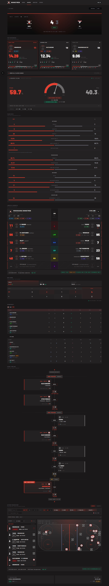
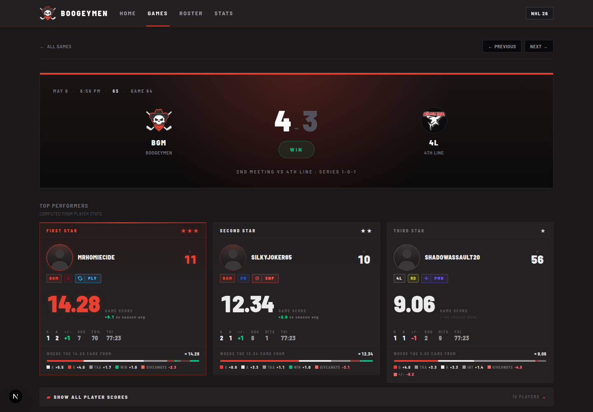
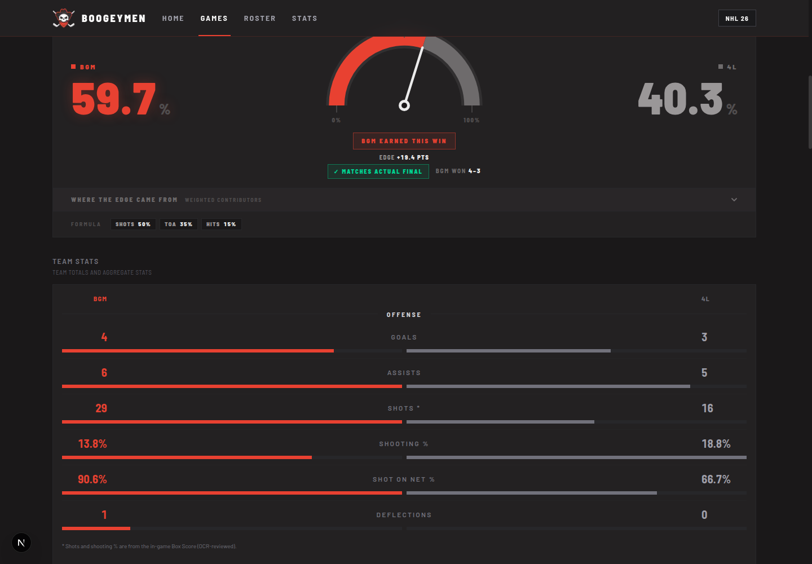
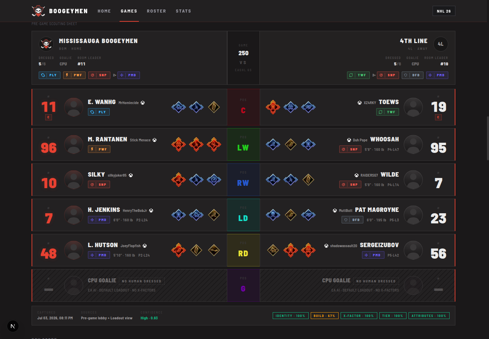
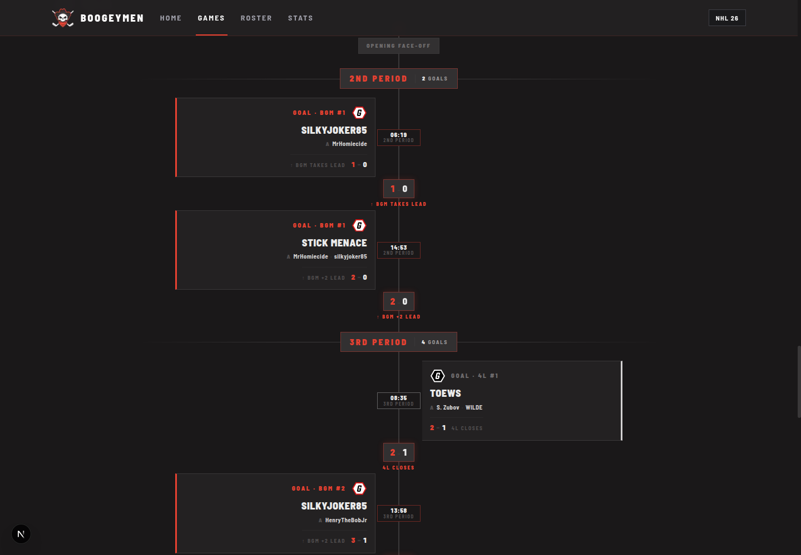
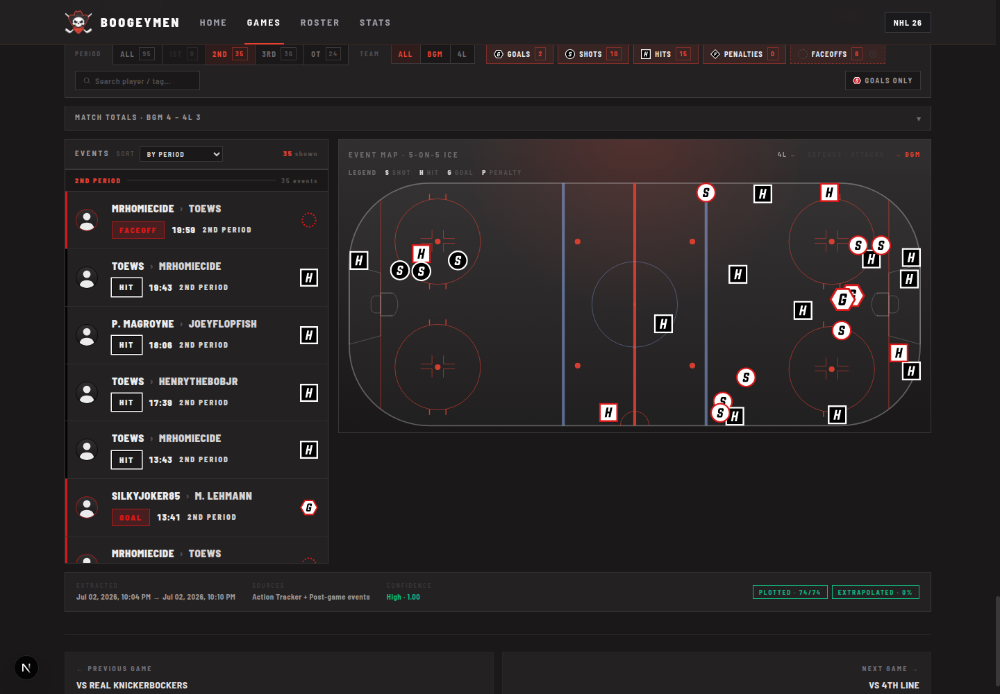

# Game Page — Design Reference

> **Audience:** a design-focused Claude session polishing/redesigning the game detail page.
> **Goal:** understand *what the page is, what every section shows, where its data comes from,
> and how it's currently styled* — without having to read ~200 KB of component code first.
>
> **Canonical example:** `http://localhost:3002/games/250?mode=dev&page=2`
> Match **250** = **Boogeymen (BGM) 4 – 3 4th Line (4L)**, WIN, May 8 · 6s · Game 64, 2nd meeting (series 1-0-1).
> Match 250 is the **pilot OCR-benchmark match** — the only fully OCR-ingested game — which is why every
> OCR-derived section actually has data here. On most real matches several of these sections render nothing.

Full-page render of the example:

---

## 0. About the `?mode=dev&page=2` in the URL

These two query params **do not change what the detail page renders.** They are *games-list* filter
state that the detail page only reads to rebuild its navigation links:

| Param | Meaning (on the `/games` **list**) | Effect on the **detail** page |
|-------|-----------------------------------|-------------------------------|
| `mode=dev` | Filters the list to a hardcoded curated set of match IDs (`DEV_MATCH_IDS` — OCR benchmark + retrain candidates). Other values: `6s`, `3s`, or absent = all. | None visually. Preserved in the "← All Games" and Prev/Next links so back-navigation returns to the same filtered list. |
| `page=2` | List pagination (20 per page). | None visually. Preserved in nav links so back-nav returns to the right page. |

Handled by `gamesListQuery()` in [`page.tsx`](../../../apps/web/src/app/games/%5Bid%5D/page.tsx) (lines ~274–285).
The list-page source of `mode=dev` / `DEV_MATCH_IDS` is [`games/page.tsx`](../../../apps/web/src/app/games/page.tsx) (lines ~28–41).

**Takeaway for design:** the page looks identical at `/games/250` and `/games/250?mode=dev&page=2`.

---

## 1. Route & data architecture

- **Route:** `apps/web/src/app/games/[id]/page.tsx` — an **async Server Component**. No client wrapper.
- **Caching:** `export const revalidate = false` — match data never changes once written, cached indefinitely.
- **Data fetch:** one `getMatchById` (404s if missing), then **~14 secondary queries fired in parallel**
  via `Promise.all`, each wrapped in a `safe()` helper. **Any secondary query can fail independently** and
  its section simply hides — the hero + core page always render.
- **Sourcing model (important):** the site blends two data sources per match:
  - **EA official** — the API box score. Always present.
  - **OCR-reviewed** — stats extracted from post-game screen recordings (period splits, shot types, event
    coordinates, faceoff dots, pre-game loadouts). Present only for matches that have been recorded + OCR'd.
  - Several sections **prefer OCR when reviewed** and fall back to EA. Source is disclosed on-screen via a
    green "OCR · post-game" dot vs a grey "EA · official" dot (see `SourceBadge`, `OcrProvenanceFooter`).

---

## 2. Design system (tokens)

Defined in `apps/web/src/app/globals.css`. Always-dark, red-accent, sharp esports aesthetic.

| Token | Value | Role |
|-------|-------|------|
| `--color-accent` | `#e84131` | **Boogeymen red** (warm). BGM identity, winners, rank-1, active tabs. |
| `--color-accent-strong` | `#c2321f` | Pressed/darker red. |
| `--color-background` | `#1a1819` | Page background. |
| `--color-surface` | `#232122` | Default panel surface. |
| `--color-surface-raised` | `#2a2829` | Hover/raised. |
| `--color-charcoal` | `#323031` | Official Boogeymen charcoal (bar/track fills). |
| `--color-border` | `#3a3839` | Hairline border (1px, everywhere). |
| `--color-win` | `#10b981` | Emerald — wins, positive deltas, boosts. |
| `--color-loss` | `#ef6a5e` | Light red — losses, negative deltas. |
| `--color-otl` | `#f59e0b` | Amber — OTL, ties, penalties, "too close to call". |
| `--color-fg-1 … fg-6` | `#ebebeb → #3a3839` | Foreground ramp: fg-1 headlines/scores → fg-4 uppercase labels → fg-6 faint separators. |

- **Type:** `--font-sans` = Barlow; `--font-condensed` = Barlow Semi Condensed. The UI is overwhelmingly
  **condensed, UPPERCASE, wide letter-spacing (~0.2em), `tabular-nums`** for every stat.
- **Shape language:** **square corners everywhere** (no border-radius) except circular avatars/crests and the
  archetype pills. 1px `--color-border` hairlines. No shadows except intentional red glows.
- **Signature motif — the "ticker strip":** a thin (1–3px) red gradient bar (`from-rose-900 via-accent
  to-rose-900`) across the top edge of "broadcast" panels (Deserve-to-Win, active Box Score tab, star rank-1).
- **Mirroring motif:** BGM content is left-aligned / red; opponent content is right-aligned / grey. This
  left-vs-right mirroring recurs in the hero, lineup ladder, event timeline, and box score.
- **BGM = red, opponent = grey** is the universal "who's who" convention across numbers, bars, and rails.

---

## 3. Page anatomy (render order)

Top → bottom, exactly as `page.tsx` renders them:

| # | Section | Component | Header text | Data source | Hides when… |
|---|---------|-----------|-------------|-------------|-------------|
| — | Sub-nav | `GameDetailNav` (in page.tsx) | "← All Games" / Prev / Next | adjacency query | never (shows disabled arrows) |
| 1 | Hero scoreboard | `HeroCard` | *(none)* | EA match | never (it's the hero) |
| 2 | Top Performers | `TopPerformers` → `StarCard` ×3 + `ShowAllPlayerScores` | "Top Performers" | player stats (game-score model) | no players at all |
| 3 | Deserve to Win | `PossessionEdgeBar` | "Deserve to Win" | OCR-preferred shots/TOA/FO/hits | shots **and** hits both 0 |
| 4 | Team Stats | `TeamStats` | "Team Stats" | EA + OCR shots | no groups/rows |
| 5 | Lineup & Loadouts | `LineupSection` | "Lineup & Loadouts" | OCR loadouts *or* box-score fallback | never (always 6 rows) |
| 6 | Box Score | `BoxScore` | "Box Score" | OCR per-period | no period rows |
| 7 | Shot Mix | `ShotMix` | "Shot Mix" | OCR shot types | no usable shot-type data *(hidden on match 250)* |
| 8 | Scoresheet | `ScoresheetSection` | "Scoresheet" | EA player stats | both teams empty → `EmptyScoresheet` |
| 9 | Event Timeline | `EventTimeline` | "Event Timeline" | OCR goal/penalty events | (header always shows; body empty if no events) |
| 10 | Action Tracker Map | `ActionTrackerMap` | "Action Tracker Map" | OCR event coords + faceoff dots | (Faceoffs view hidden without faceoff data) |
| 11 | Prev/Next footer | `ContextFooter` | *(none)* | adjacency query | both neighbors absent |

> **Note:** on match 250, **Shot Mix (7) is not present** — no usable shot-type breakdown existed, so the
> component returned `null`. This is the normal "section self-hides" behavior; don't design around it always
> being there.

All section files live in `apps/web/src/components/matches/`. View-model builders (what shapes the data
before it hits the components) live in `apps/web/src/lib/match-recap.ts`.

---

## 4. Section-by-section

### 1 · HeroCard — `hero-card.tsx`
Broadcast-style final-score banner. **Server component.**

- **Shows:** meta strip (date · time · mode · "Game {n}"), BGM crest + opponent crest (or 2-letter abbrev
  fallback), team abbreviations + full names, huge final score `4 – 3`, a `ResultPill`, and a series/meeting
  context line ("2nd meeting vs 4th Line · series 1-0-1").
- **Layout:** full-width bordered card, **1px colored top bar keyed to result** (WIN=red, LOSS=zinc, OTL=amber),
  **per-result background gradient** (WIN = red radial glow). 3-column grid `[1fr auto 1fr]`: BGM side / center
  score block / opponent side. Score is `text-5xl→7xl`, condensed black, tabular.
- **Result-coding:** the winning team's score number renders bright; the loser's dims. On a WIN, BGM is bright
  and opponent grey; a LOSS flips it. So the winning number visually "wins" at a glance.

### 2 · Top Performers — `top-performers.tsx` + `star-card.tsx` + `show-all-player-scores.tsx`
The three-star podium plus a collapsible full-roster score table.

- **Header:** "Top Performers" / "Computed from player stats" (`SectionHeader`).
- **Grid:** 1-col mobile → **3-col `StarCard` podium** at `sm+`, then the "Show all player scores" expander.
- **StarCard** (per star): rank label ("First/Second/Third Star" + ★ glyphs), silhouette portrait, gamertag,
  jersey #, team badge + `PositionPill` + `ArchetypePillCompact`; a huge **game score** (2 dp) with a
  **"vs season avg" delta** (green `+`/red `−`, or "— no season data"); a stat line
  (skaters: G · A · +/− · SOG · FO%/Hits · TOI; goalies: SV · SA · SV% · GA); and a **"Where the N came from"
  segmented breakdown bar** with a color-coded factor legend. **Rank-1 gets the full red treatment** (accent
  border, red ticker strip, glowing jersey/score, red portrait ring). Whole card links to `/roster/{id}` for
  BGM players; opponent cards are non-linked.
- **ShowAllPlayerScores** (**client**): collapsed button "▰ Show all player scores · {N} players ⌄". Opens a
  ranked table of *every* player (both teams): #, team/pos chip, player, G/A/+-/SOG/Hits/TOI·SV%, Score.
  **Each row expands (accordion) into a Factor / Stat / Weight / Points breakdown table.** Top-3 rows get
  descending accent washes + star badges.
- **Score model:** `buildAllTeamScores` / `buildTopPerformers` / `computeSeasonAvgs` / `attachSeasonAvgs`
  in `match-recap.ts`. Opponents have `playerId=null` (never linkable), and `vsSeasonAvg=null`.

### 3 · Deserve to Win (Possession Edge) — `possession-edge.tsx`
A "who deserved to win" analytics gauge. **Not a React client component** — uses native `
` + CSS.

- **Header:** "Deserve to Win · Weighted team totals" with a **SourceBadge** (green "OCR · post-game" dot).
- **Shows:** two big side percentages (BGM 59.7% vs 4L 40.3% here), a **semicircular SVG gauge** with a needle
  at BGM's share (0/50/100 ticks), a verdict badge ("BGM Earned This Win" / "Should Have Won" / "Too Close to
  Call") + "Edge +19.4 pts", a **result-match footnote** ("✓ Matches actual final · BGM won 4–3", or "⚠ Result
  mismatch"), a collapsible **"Where the edge came from"** contributor list (Shots / TOA / Faceoff % / Hits,
  each with weight %, dueling bar, signed "to DtW" delta), and a **"Formula"** row (Shots 50% · TOA 35% ·
  Hits 15% — weights adapt to which OCR data exists).
- **Color logic:** winning side's % + gauge arc turn accent-red (with glow); coin-flip → both arcs amber; the
  result-match badge is green when the model agrees with reality, amber when it disagrees. Missing contributors
  render hatched "OCR missing" rows.
- **Builder:** `buildPossessionEdge` — **returns null (hides section) when shots and hits are both 0.**

### 4 · Team Stats — `team-stats.tsx`
Head-to-head team totals as dueling bars. **Server component, static.**

- **Header:** "Team Stats / Team totals and aggregate stats"; columns **BGM (red)** vs opponent abbrev (grey).
- **Groups** (empty rows/groups dropped): **Offense** (Goals, Assists, Shots*, Shooting %, Shot On Net %,
  Deflections, Power Play), **Possession** (Face Off %, Pass %, Possession, Time on Attack), **Defense** (Hits,
  Blocked Shots, Takeaways, Interceptions, SH Goals), **Discipline** (Giveaways, Penalties — both tagged
  **"↓ BETTER"**), **Goalie** (Saves, GA, Save %).
- **Layout:** `Panel`; each group titled with `—— TITLE ——` centered rules; each stat is a `[5rem 1fr 5rem]`
  row — BGM value (xl, red) · centered label · opponent value (xl, grey) — with **two proportional comparison
  bars** beneath (BGM red / opp grey, denominator floored at 5 so small counts don't read as blowouts).
- **`*` on "Shots"** + a footnote means the shot total came from OCR box score rather than EA. Builder:
  `buildBoxScore`.

### 5 · Lineup & Loadouts — `lineup-section.tsx` (+ ladder/row/card/expand-panel)
A position-matched **pre-game scouting sheet**, BGM vs opponent, one row per position (C/LW/RW/LD/RD/G).
This is the largest, most feature-rich section. **Server-rendered shell; client interactivity via the ladder.**

- **Header:** "Lineup & Loadouts / Pre-game scouting sheet".
- **Summary band:** 3-col `[1fr 96px 1fr]` — BGM (name, crest, `Dressed N/6`, Goalie, Room Leader, build-chip
  distribution) · center `Game / {matchId} / VS / EASHL 6s` · opponent (mirror, darker tint).
- **Ladder:** 6 stacked matchup rows. Each **player card** shows jersey # (huge 44px), captain "C", avatar,
  persona (in-game skin name) + gamertag (roster link), platform glyph (Xbox/PS), archetype pill, H/W/H line,
  EASHL level `P{n}·L{n}`, and up to 3 **X-Factor** icons. BGM card has a red left border; opponent card is
  mirrored with a red right border. Empty slots → **CPU placeholder** (diagonal hatch, "No human dressed",
  "EA AI · default loadout · no X-Factors").
- **Expandable rows (`ocr` variant, skaters only):** clicking a row opens `LineupExpandPanel` — a BGM-vs-opp
  **Build / X-Factors / 22-attribute** comparison (Technique/Power/Playstyle/Tenacity/Tactics), with signed
  boost/nerf deltas drawn as green-boost / striped-red-nerf bars, and a per-side Expand⇄Compare toggle. One
  row open at a time.
- **Two variants** (page picks automatically):
  - **`ocr`** (has loadout snapshots) — the rich ladder above; footer = `OcrProvenanceFooter`
    (Captured / Sources / Confidence + per-field badges "Identity · 100%", "Build · …", "X-Factor · …").
  - **`boxScore`** (no OCR loadouts) — lean fallback synthesized from the final box score: cards show only
    name + build archetype, **not expandable**, both D slots shown as neutral "D"; footer = a dim note
    "Lineup from box score · pre-game loadouts not captured for this match".
- **Builders:** `buildLineupFromStats` (fallback rows), `applyLoadoutOverrides` (overlay OCR position/jersey/
  archetype onto stat rows used by Stars/Scoresheet).

### 6 · Box Score — `box-score.tsx`
Period-by-period comparison. **Client component** (tabbed).

- **Header:** "Box Score / Period-by-period · OCR-reviewed".
- **3 mode tabs** (`role=tablist`, arrow-key nav): **Goals / Shots / Faceoffs**. Active tab gets a red vertical
  gradient + red ticker strip + accent summary numbers. Each tab header shows an aggregate summary
  (e.g. Goals `for–against` + signed delta; Faceoffs `pct%` + `W · total`).
- **Table:** `Team | P1 | P2 | P3 | OT… | Total`. **Total column emphasized** (red left border, faint red
  gradient, accent text). BGM row label red / opponent grey. Period-winning cells highlighted; winning totals
  glow. Missing periods show `—` and are excluded from totals (called out in footnotes).
- **Footer:** left = periods where "OCR unavailable — excluded from totals"; right = source pill
  (green "OCR-reviewed · post-game" vs grey "EA · official"). Returns `null` with no period rows.

### 7 · Shot Mix — `shot-mix.tsx`  *(self-hidden on match 250)*
Per-side shot-type breakdown. **Server component, static.**

- **Header:** "Shot Mix" + dynamic subtitle ("Most BGM shots: Wrist · Most OPP shots: Slap") or fallback.
- **Shows:** a Total row then Wrist / Snap / Backhand / Slap / Deflection / Power Play, BGM vs opponent, in a
  `[1fr 5rem 5rem]` grid (BGM red header, OPP slate). Returns `null` when no usable shot-type data — which is
  why it's absent from the match-250 render.

### 8 · Scoresheet — `scoresheet.tsx`
Two-team box score with expandable per-skater drilldowns. **Client component.**

- **Header:** "Scoresheet". Per-team heading: crest + label + red "BGM" home pill.
- **Skater columns:** Player (name + position pill), G, A, **PTS** (featured), +/− (green/red), SOG, Hits, Blks
  (last two hidden on mobile). **Goalie columns:** Goalie (green "G" pill), SV, GA, **SV%** (featured, `.917`),
  SA, TOI.
- **Expandable skater rows** (▸ chevron, keyboard-accessible): open a drawer with a highlight grid (Game Score,
  Shot On Net %, Shooting %, Pass %, FO %, Possession) + grouped panels (Shooting / Passing & Possession /
  Faceoffs / Special Teams / Discipline / Defense / Turnovers / Workload). Expanded row gets a red left accent
  border. Badges: red "DNF", amber "Guest".
- **Names** link to `/roster/{id}` for BGM, plain span for opponents. Empty both sides → page renders
  `EmptyScoresheet` ("No player stats recorded for this game."). Builder: `buildScoresheet`.

### 9 · Event Timeline — `event-timeline.tsx`
A dual-sided, story-mode chronological scoresheet. **Client component, mostly non-interactive.**

- **Header:** "Event Timeline / Game flow · goals + penalties".
- **Shows:** a central vertical rail (glowing red end-caps) with **BGM goal/penalty cards on the LEFT,
  opponent on the RIGHT**, clock pills straddling the rail. Goal cards: "Goal · BGM #N", scorer (large, linked),
  assists ("A …" or italic "Unassisted"), footer running score + **lead-change banner** ("↑ BGM takes lead",
  "+N LEAD", "— Tied", "regains lead", OT "↑ TEAM wins"). Penalty cards: amber palette, culprit, infraction,
  Minor/Major pill, PIM. Period dividers with "N Goals · N Pen" counts; "Opening face-off" top anchor and
  "Final · …" bottom anchor.
- **GWG highlight:** the game-winning goal card gets a red border + red glow + "GWG · Game-winner" ribbon and a
  glowing scorer name.
- **Color:** BGM red / opponent grey / ties white; OT dividers + tied bubbles go amber. Collapses to a single
  left-aligned column on mobile. Only `goal` + `penalty` events are shown (intentionally unfiltered narrative).

### 10 · Action Tracker Map — `action-tracker-map.tsx`
Spatial rink map of OCR-extracted events, with a second Faceoff view. **Client component — the most interactive
section.**

- **Header:** "Action Tracker Map" + a top-right **Events | Faceoffs segmented toggle** (toggle only renders
  when faceoff data exists).
- **Events view (default):**
  - **Filter bar:** Period segment (All + per-period, count badges), Team segment (All / BGM / opp), five type
    toggles (Goals/Shots/Hits/Penalties/Faceoffs, each w/ marker swatch + count), a player search box, a "Goals
    only" quick toggle, and a Sort dropdown (By period / Chronological / Newest first).
  - **Collapsible summary strip:** "Match totals · BGM N – OPP N" → Goals/Shots/Hits/Penalties + Visible/On
    rink/Off rink counts.
  - **Two-pane grid `[380px 1fr]` at `xl`:** scrollable **event-card list on the LEFT** (team-color rail,
    avatar, actor › target, type pill, clock, period; sticky red period dividers), **scale rink SVG on the
    RIGHT** (sticky). Events plotted at (x,y) as letter glyphs — **S**hot=circle, **H**it=square, **G**oal=hex,
    **P**enalty=diamond. Home markers = white ring + team-color fill; away = team-color ring + white fill.
  - **Full hover/selection sync** between cards ⇄ markers (halo, beacon glow, other markers fade to 18%,
    auto-scroll card into view), keyboard nav (arrows/Enter/Escape), tooltips, amber "Approx" low-confidence
    badges, 50%-opacity extrapolated markers.
- **Faceoffs view:** two side summary rows (Overall %, OZ, DZ wins/total) + **9 canonical faceoff dots**, each
  with a **pair of pennant pins** (away-left / home-right) carrying win counts. Static (no card sync).
- **Per-match OCR team colors** (BGM red default `#ce202f`, opp navy `#233f94`) drive marker fills, rails,
  pills, and pins via React context. Footer = `OcrProvenanceFooter` (confidence, "Plotted N/N", extracted-at).

### 11 · Context Footer — `context-footer.tsx`
Prev/next game navigation. **Server component.**

- Two mirrored `Panel` cards ("← Previous game" left / "Next game →" right, right-aligned), each with
  "vs {opponent}" + `ResultPill` + score + date, linking to `/games/{id}`. Missing side → dashed placeholder.
  Returns `null` if both neighbors absent.

---

## 5. Cross-cutting motifs (design language to preserve or evolve)

1. **BGM-red vs opponent-grey** is the universal team encoding — numbers, bars, rails, pills, markers.
2. **Left/right mirroring** — BGM left, opponent right — in hero, lineup, timeline, action list, box score.
3. **Result/winner coloring** — winning score/percentage/arc brightens to red (with glow); loser dims. Amber
   is the "tie / OTL / too-close / penalty" secondary state.
4. **The red "ticker strip"** (thin gradient bar) marks "premium/broadcast" panels and active states.
5. **Provenance is always disclosed** — green "OCR · post-game" vs grey "EA · official" dots, plus the
   `OcrProvenanceFooter` (Captured / Sources / Confidence + per-field %).
6. **Square, condensed, uppercase, tabular** everything — except circular avatars/crests and the archetype
   pills (the one decorative, gradient/clip-path/glow element in the system).
7. **Graceful degradation is structural** — every OCR section self-hides or falls back rather than erroring.
   The page must read well whether a match has full OCR (like 250) or EA-only data.

## 6. Known inconsistencies / design opportunities

- **Two X-Factor visual languages coexist:** `LineupSection`/`LineupExpandPanel` use real tier-colored PNG
  icons (Elite=red / All-Star=neutral-light / Specialist=neutral-dim), while the older `LineupCard` uses text
  pills with Elite=red / **All-Star=blue** / **Specialist=yellow**. Worth unifying. (Note: `LineupCard` is a
  legacy simpler component and is **not** the one rendered on this page — the page uses `LineupSection`.)
- **`BroadcastPanel`** component exists as the canonical red-glow surface, but the Action Tracker rink reaches
  for the `broadcast-panel-strong` CSS class directly instead of the component — surfaces aren't fully
  componentized.
- **Section header styles differ:** most sections use `SectionHeader` (dim uppercase label + subtitle), but
  "Deserve to Win" uses its own red ▰-prefixed header treatment. Intentional emphasis, but inconsistent.
- **Density:** the page is ~7700px tall at desktop width with 10+ heavy sections. Consider whether some
  OCR-heavy sections (Action Tracker, per-period Box Score) warrant progressive disclosure.

---

## 7. File map

| Concern | Path |
|---------|------|
| Page route / section order / data fetch | `apps/web/src/app/games/[id]/page.tsx` |
| Games **list** (source of `mode`/`page`/`DEV_MATCH_IDS`) | `apps/web/src/app/games/page.tsx` |
| View-model builders (scores, box score, lineup, DtW, scoresheet) | `apps/web/src/lib/match-recap.ts` |
| Section components | `apps/web/src/components/matches/*` |
| Shared UI (SectionHeader, Panel, ResultPill, crest, pills, BroadcastPanel) | `apps/web/src/components/ui/*` |
| Design tokens | `apps/web/src/app/globals.css` |
| Position colors (single source of truth) | `apps/web/src/lib/position-colors.ts` |
| Archetype catalog (11 archetypes: color/icon/name) | `apps/web/src/components/ui/archetype-pill.tsx` + `archetype-icons.tsx` |

## 8. Screenshots

All captured live from `/games/250?mode=dev&page=2` at 1440px width (dark theme).

| File | What |
|------|------|
| `shots/full-page.png` | Entire page, top to bottom |
| `shots/sec-hero-stars.png` | Hero scoreboard + Top Performers podium |
| `shots/sec-dtw-teamstats.png` | Deserve to Win gauge + Team Stats bars |
| `shots/sec-lineup.png` | Lineup & Loadouts ladder |
| `shots/sec-timeline.png` | Event Timeline (dual-rail) |
| `shots/sec-action-tracker.png` | Action Tracker Map (rink + event list) |
</content>
</invoke>
