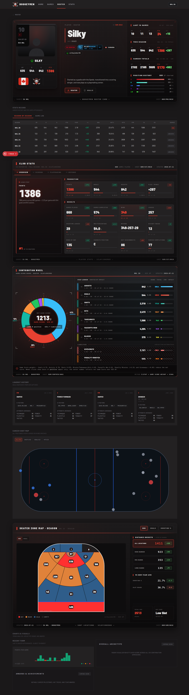

# Roster Player Page — Design Reference

> **Audience:** a design-focused Claude session polishing/redesigning the individual player profile page.
> **Goal:** understand _what the page is, what every section shows, where its data comes from, and how it's
> currently styled_ — without reading ~4,000 lines of component code first.
>
> **Canonical example:** `http://localhost:3002/roster/2`
> Player **silkyjoker85** ("Silky", jersey #10) — the club's highest-volume skater, so nearly every section
> has real data here (660 GP career, a multi-game career history, OCR loadout snapshots, and enough positioned
> events to draw the career shot map). On thinner players several sections self-hide (see the "Hides when…"
> column in §3). Use this player to see the page at **full density**.

Full-page render of the example:

---

## 0. Route & URL params

- **Route:** `apps/web/src/app/roster/[id]/page.tsx` — an **async Server Component**. The `[id]` is the
  internal `players.id` (surrogate PK), **not** the jersey number or `ea_id`. `/roster/2` = player id 2.
- **Caching:** `export const revalidate = 3600` — profile regenerates at most hourly (ISR).
- **404s** via `notFound()` when the id isn't numeric or no player row exists.

Three query params, all optional, all read on the server:

| Param       | Values               | Effect                                                                                                                                                                                                                             |
| ----------- | -------------------- | ---------------------------------------------------------------------------------------------------------------------------------------------------------------------------------------------------------------------------------- |
| `?role=`    | `skater` \| `goalie` | Forces the profile into skater or goalie mode (only honored if that role has data). Otherwise the page uses the player's `primaryRole`. Drives **the entire page** — ledger, tables, club-stats tabs, contribution view, shot map. |
| `?mode=`    | `6s` \| `3s`         | Filters the **Game Log** (and its count) to one EASHL mode. Absent = all modes, and the Game Log then shows a "Mode" column.                                                                                                       |
| `?logPage=` | `1..N`               | Game Log pagination (20 rows/page). Only relevant once the log is expanded.                                                                                                                                                        |

The **role tabs** in the hero and the **mode filter** in the Game Log are `<Link>`s that just rewrite these
params — every "interaction" that changes data is a server round-trip, not client state. (Tabs _within_ a
section — Season-vs-GameLog, Club-Stats categories, shot-map views — are true client state.)

---

## 1. Data architecture

The page fires its queries in three tiers, all in `page.tsx`:

1. **Core `Promise.all` (6 queries)** — if _any_ throw, the whole page renders a single centered
   `ErrorState` panel ("Unable to load player data right now."). These are:
   `getPlayerProfileOverview`, `getPlayerCareerSeasons`, `getPlayerEASeasonStats`,
   `getPlayerGamertagHistory`, `getPlayerGameLog`, `countPlayerGameLog`.
2. **Best-effort singles (each in its own try/catch → `[]`/`null` on failure)** — a failure here hides only
   that section: `getPlayerLoadoutSnapshots` (loadout strip), `getPlayerCareerShots` (career map),
   `getTeamAverageShotLocations` + `getTeamAverageGoalieShotLocations` (shot-map baselines),
   `getAllEASeasonStatsForGameTitle` (teammate pool for all ranking).
3. **`notFound()`** if the overview came back null.

**Two data provenances**, disclosed on-screen:

- **EA official** — the Pro Clubs API season aggregates + local match records. Badged **"EA"** (red).
- **Historical / archive** — hand-reviewed screenshots from older game titles (NHL 22–24). Badged
  **"Archive"** (grey). Only appears in the career-by-season table.
- **OCR** — the Loadout History strip and Career Shot Map are sourced from OCR of post-game recordings;
  they simply don't render for players without captures.

**Key derived concepts** the page computes:

- **Selected role** (skater/goalie) gates almost everything. `hasSkaterData`/`hasGoalieData` decide whether
  the role toggle even appears.
- **Archetype** — a manual `players.archetype` wins; otherwise a stat heuristic (`computeSkaterArchetype`:
  Enforcer / Sniper / Playmaker / Two-Way / Balanced) labels skaters with ≥5 GP.
- **Shot maps are NHL-26-only** — the zone map resolves `shotLocations` off the NHL 26 EA row specifically;
  older titles have no coordinate data.

---

## 2. Design system (tokens)

Defined in `apps/web/src/app/globals.css`. Always-dark, red-accent, sharp "broadcast strip" esports aesthetic.
Identical token set to the rest of the site — see `docs/design/game-page/README.md §2` for the shared table.
The tokens this page leans on most:

| Token                            | Value                             | Role on this page                                                                                             |
| -------------------------------- | --------------------------------- | ------------------------------------------------------------------------------------------------------------- |
| `--color-accent`                 | `#e84131`                         | Boogeymen red — active tabs, lead stats, rank-1, the "▌" section ticks, EA badge.                             |
| `--color-background`             | `#1a1819`                         | Page background.                                                                                              |
| `--color-surface` / `-raised`    | `#232122` / `#2a2829`             | Panel fills / hover.                                                                                          |
| `--color-border`                 | `#3a3839`                         | 1px hairline borders (everywhere; `zinc-800` is used interchangeably in Tailwind classes).                    |
| `--color-win` / `-loss` / `-otl` | `#10b981` / `#ef6a5e` / `#f59e0b` | Emerald wins / red losses / amber OTL — used by result pills, +/− coloring, trend bars.                       |
| `--pos-c/lw/rw/ld/rd/g`          | reds→greens→blues→purple          | **Position palette** — colors the jersey position pill, hero identity pill swatch, and Position-History bars. |
| `--color-fg-1 … fg-6`            | `#ebebeb → #3a3839`               | Foreground ramp: headline stats → uppercase labels → faint separators.                                        |

- **Type:** `--font-sans` = Barlow; `--font-condensed` = **Barlow Semi Condensed**. The UI is overwhelmingly
  **condensed, UPPERCASE, wide letter-spacing (~0.18–0.22em), `tabular-nums`**.
- **Shape language:** **square corners** (`rounded-none`) on every panel; 1px hairlines; no shadows except
  deliberate red glows. Circular only for the donut/wheel and the portrait silhouette.
- **Signature motifs:** the **"▌" red tick** prefixing sub-headers; a thin red **"ticker" gradient bar**
  across the top of broadcast panels (`.ph-ticker`, `.cs-ticker`, `.cw-ticker`, `.sm-ticker`); **corner
  registration marks** on the hero; **`Sheet BGM/XXX/NNNN` footers** stamping each module like a spec sheet.
- **Green/red delta chips** (`+1.3`, `−6.4`, `#1 of 10`) recur wherever a value is compared to teammates or a
  team average — this "vs the room" framing is the page's core analytical idea.

Two component families back the layout:

- **`Panel`** (`ui/panel.tsx`) — the plain sharp-bordered container (Stats Record, Game Log, Loadout,
  Career Map, the goalie contribution view).
- **Bespoke CSS modules** — the hero, Club Stats, Contribution Wheel, and Shot Map are each their own
  hand-authored `.css` file (`profile-hero.css`, `club-stats-tabs.css`, `contribution-wheel.css`,
  `shot-map.css`) with a much richer "broadcast card" treatment. **These four are the visually heaviest,
  most distinctive modules** and where most design attention has gone.

---

## 3. Page anatomy (render order)

Top → bottom, exactly as `page.tsx` renders. Everything is stacked full-width with `space-y-8`.

| #   | Section              | Component                                                                  | Header text                             | Data / role                                        | Hides when…                                                     |
| --- | -------------------- | -------------------------------------------------------------------------- | --------------------------------------- | -------------------------------------------------- | --------------------------------------------------------------- |
| —   | Back link            | inline                                                                     | "← Roster"                              | —                                                  | never                                                           |
| 1   | **Profile Hero**     | `ProfileHero`                                                              | _(none — it's the hero)_                | overview + career + gamertag history               | never                                                           |
| 2   | No-data notice       | inline `Panel`                                                             | "No local match history yet."           | —                                                  | only shows when player has **no** local season + 0 logged games |
| 3   | **Stats Record**     | `StatsRecordCard` → `CareerSeasonsTable` + `PlayerGameLogSection`          | "Stats Record"                          | career seasons / local game log                    | never (empties render inline)                                   |
| 4   | **Club Stats**       | `ClubStatsTabs`                                                            | "▌Club Stats"                           | EA season aggregate (focal title) + teammate ranks | no EA season row at all                                         |
| 5   | **Contribution**     | `ContributionSection` → `ContributionWheel` (skater) / donut+bars (goalie) | "Contribution Wheel" / "Season Profile" | EA season + teammate pool                          | < 1 GP (shows an empty panel)                                   |
| 6   | **Loadout History**  | `LoadoutHistoryStrip`                                                      | "Loadout History"                       | OCR loadout snapshots (≤4)                         | zero snapshots (`return null`)                                  |
| 7   | **Career Shot Map**  | `CareerShotMap`                                                            | "Career Shot Map"                       | OCR positioned events (≤500)                       | < 5 positioned events (`return null`)                           |
| 8   | **Zone Map**         | `ShotMap` (skater **or** goalie)                                           | "Skater/Goalie Zone Map · Season"       | NHL 26 shot locations + team avg                   | renders an empty-state card if no NHL 26 location data          |
| 9   | **Charts & Visuals** | `ChartsVisualsSection` → `TrendChart` + 2× `ComingSoonCard`                | "Charts & Visuals"                      | last-15 role-filtered games                        | Trend falls back to a "Coming Soon" card with < 1 game          |

All section components live in `apps/web/src/components/roster/`.

---

## 4. Section-by-section

### 1 · Profile Hero — `profile-hero.tsx` (+ `profile-hero.css`, `portrait-card.tsx`)

The signature module: a **3-column "roster card"** styled like an official player dossier, with corner
registration marks and a `Source EA NHL — Boogeymen Roster Card — Sheet BGM/PRO/0010` footer. **Server component.**

- **Col 1 — Portrait Monolith** (`PortraitCard`): huge jersey number (#10), a color-coded position pill, a
  record + win% chip (`94.7% Win`), an abstract SVG **silhouette portrait** with a scan-line, the display
  name + platform glyph, a 4-up mini-stat block (skater: **GP / G / A / PTS**; goalie: **GP / W / SO / SV%**),
  and an identity footer (nationality flag + BGM skull crest).
- **Col 2 — Identity:** eyebrow (`Player · Skater` + `ID BGM-0010`), big **nameplate** (`playerName` or
  gamertag) with an **"aka …"** list of prior gamertags, a row of **pills** (position w/ swatch, archetype,
  nationality, gamertag+platform), the freeform **bio**, and — if the player has both skater and goalie data —
  the **Skater / Goalie role toggle** (`<Link>` tabs).
- **Col 3 — Stat Ledger** (`aside`): three stacked ledger blocks — **Last 10 Games** (per-game, role-aware),
  **This Season** (EA totals for the current title), **Career Totals** (summed across titles, subtitle shows
  the title range e.g. "NHL 22–26 · sum") — each a 5-up `GP / G / A / PTS / +/−` (skater) or
  `GP / REC / SV% / GAA / SO` (goalie) grid with the lead stat glowing red. Below them, a **Position History**
  block: horizontal bars per position (C/LW/RW/D/G) sized by GP, each in its position color, with GP + share%.
- **Role-awareness:** the entire hero (mini-stats, ledgers, record chip, archetype) recomputes for the
  selected role. Numbers are `tabular-nums`; +/− is green/red.

### 2 · No-data notice — inline

A single dim `Panel` reading "No local match history yet. …EA season totals may still show while local
sections stay empty." Only appears when the player is registered but has **no** local season and **0** logged
games. (Not present for silkyjoker85.)

### 3 · Stats Record — `stats-record-card.tsx` (+ `career-seasons-table.tsx`, `player-game-log-section.tsx`)

A `SectionHeader` ("Stats Record / Career history and per-game appearances") over a **2-tab client switch**:
**Season-by-Season** and **Game Log**.

- **Season-by-Season** (`CareerSeasonsTable`): one row per game title where the selected role has GP > 0,
  newest title first, each with a **Source badge** (red **EA** vs grey **Archive**). Skater columns:
  `Season · GP · G · A · PTS · P/GP · +/− · SOG · SHT% · HITS · PIM · TA · GV`. Goalie columns:
  `Season · GP · W · L · OTL · SV% · GAA · SO`. Season name links to `/stats?title=…`; +/− is green/red;
  horizontal-scrolls on narrow screens (`min-w-[820px]`).
- **Game Log** (`PlayerGameLogSection`, **client**): a `Date · Opponent · [Mode] · Result · Score · G · A ·
PTS · +/− · SV` table of local tracked appearances. **Mode filter** (All / 6s / 3s) as `<Link>` pills;
  the "Mode" column only shows when unfiltered. Shows 5 rows collapsed with a **"Show N more"** toggle, then
  paginates (Older/Newer) once expanded. Opponent links to `/games/{matchId}`; goalie rows blank the skater
  columns and vice-versa; results use `ResultPill` (WIN/LOSS/OTL/DNF).

### 4 · Club Stats — `club-stats-tabs.tsx` (+ `club-stats-tabs.css`)

The EA-season deep-dive: a broadcast module with a header (`▌Club Stats`, scope
`EA-Reported · Full Season · NHL 26 · gamertag`, and `Games Played · Sheet BGM/CST/0010 · Updated {date}`
meta), a red ticker strip, and **numbered category tabs**. **Client component.**

- **Skater tabs:** `01 Overview · 02 Scoring · 03 Playmaking · 04 Defense`.
  **Goalie tabs:** `01 Overview · 02 Saves · 03 Situations`.
- **Layout per tab:** a left **Marquee** ("Lead Stat" — one hero number + a sentence description + a
  `#R of N skaters` rank chip) beside a grid of **Subsections**, each a titled block (`▌Production`,
  `▌Results`, `▌Shooting`, …) of stat **cells**.
- **Each cell:** label, big value (+ optional `%` unit), a **normalized bar**, a **rank line** (`#3 of 10`),
  a **per-game readout** (`0.83/G`), and a **green/red delta chip vs team average**. One cell per subsection
  is the **lead** (red glow). Ranking & deltas come from the teammate pool (`getAllEASeasonStatsForGameTitle`)
  filtered to same-role players; direction is per-stat (`asc` for "lower is better" — PIM, giveaways, losses).
- This is the **densest** section: ~40 skater metrics across the four tabs (points, PP/SH/GW goals, hat
  tricks, shooting/breakaway/penalty-shot %, passing, dekes, possession, TOI, hits, blocks, takeaways,
  faceoffs, discipline…). Goalie mode covers SV%, GAA, shutouts, workload, and breakaway/penalty/shootout
  situational splits. Footer: `Source EA NHL · Boogeymen — Player Stats · gamertag — Sheet BGM/CST/0010`.

### 5 · Contribution — `contribution-section.tsx`

**Two entirely different visualizations depending on role.**

- **Skater → Contribution Wheel** (`contribution-wheel.tsx` + `.css`, **client**): a **donut/radial** whose
  slices are each positive stat's **share of impact**, where impact = `stat × Dom-Luszczyszyn-Game-Score
weight` (Goals 0.75, Assists 0.70, Shots 0.075, Blocks/Takeaways/Hits 0.05, Faceoffs 0.01). The center
  shows **net Game Score** (`+positive / −liabilities`), with **Penalty Minutes (−0.15)** and
  **Giveaways (−0.05)** pulled out as "Liabilities" that reduce net but don't take wheel slices. Beside it is
  a **Stat Ledger** (`RANK · TOTAL · /GM · IMPACT` per stat, sorted by impact, with per-stat bars). Segments
  and ledger rows are **interactive**: hover/focus previews a stat in the center; click **locks** it (ESC or
  click-outside unlocks). Top-3 slices get leader-line callouts. A `< 10 GP` sample warning shows when thin.
- **Goalie → Season Profile** (inline in `contribution-section.tsx`): the older **donut + metric-bars**
  treatment — a normalized-vs-teammates SVG donut plus a grid of labeled `MetricBar`s, headed
  "Normalized vs teammates in the same role · goalie view".
- Empty state (either role) is a centered "Not enough … data" panel.

### 6 · Loadout History — `loadout-history-strip.tsx`

A row of up to **4** recent **build snapshots** from OCR'd loadout/lobby captures. **Server component,
`return null` if none.**

- **Header:** "Loadout History / Build snapshots from OCR captures".
- **Each card:** position tag (accent) + capture date; **build class** (e.g. "Sniper", "Power Forward",
  "Grinder") with H/W/handedness + player level; a wrapped list of **X-Factor** chips; and a 5-group
  **Attribute Averages** table (Technique / Power / Playstyle / Tenacity / Tactics), each the mean of its
  member attributes. Grid: 1-col → 2 → 4 across breakpoints.

### 7 · Career Shot Map — `career-shot-map.tsx`

A **top-down rink** aggregating every positioned event for the player across reviewed (OCR) matches.
**Client component, `return null` if < 5 events.**

- **Header:** "Career Shot Map / All positioned events across reviewed matches".
- **Filter pills** (only shown for event types that exist, with counts): All / Shots / Goals / Hits /
  Penalties / Faceoffs. Markers are color- and size-coded by type (goals = larger red, shots = grey,
  hits = blue, penalties = amber, faceoffs = small white); **extrapolated** positions (predicted outside the
  calibration hull) render at reduced opacity. Full-width horizontal `viewBox="-110 -50 220 100"` rink with
  center/blue lines and faceoff dots; each marker has a `vs opponent · period · clock` tooltip.

### 8 · Zone Map — `shot-map.tsx` (+ `shot-map.css`, `shot-map-zones.ts`)

The **NHL-26-only** zone heat map — a large broadcast module. Skater and goalie are separate renders picked in
`page.tsx`. **Client component.**

- **Header:** "▌Skater Zone Map · Season" (or "Goalie…"), scope `NHL 26 · Regular`, plus **mode tabs**:
  skater = `SOG / Goals / Shooting %`; goalie = `Shots Against / Goals Against / Save %`.
- **Left — the rink:** an **Ice / Goal** view toggle. The **Ice** view is a stylized half-rink SVG split into
  16 named zones (Crease, Low/High Slot, L/R Circle, points, corners, …), each **filled by density rank**
  (Hot / Warm / Cold / Empty) with a big number bubble per zone; the goalie view flips the ice 180°. The
  **Goal** view is a **5-zone net** (TL / TR / BL / BR / Five-Hole) with a mesh pattern. A density legend +
  `gamertag · N GP` axis sits below.
- **Right — the ledger:** **Distance Buckets** (All / High-Danger / Mid-Range / Long-Range — clickable to
  isolate zones, each with a value + delta), a **vs BGM Team Avg** comparison block (Shooting %/Save %, Slot
  Share/High-Danger Save %, Shots/Game — each with a green/red delta), and two **summary cards** (Total SOG /
  Shots Against, and the Hot / Most-Targeted zone with its share). Footer stamps
  `Updated {date} · Source EA NHL · Boogeymen — Shot Locations · gamertag — Sheet BGM/SHM/0010`.
- If the NHL 26 row has no location data, the whole thing collapses to a one-line empty-state card noting
  shot-location data is only collected for NHL 26.

### 9 · Charts & Visuals — `charts-visuals-section.tsx` (+ `trend-chart.tsx`, `coming-soon-card.tsx`)

A 2-col grid under "Charts & Visuals / Trend analysis, archetype radar, and awards":

- **Recent Form** (`TrendChart`): a compact SVG **bar chart** of the last ≤15 role-filtered appearances,
  oldest→newest, bar height = points (skater) / saves (goalie), **bar color = result** (green WIN / amber OTL
  / red LOSS), with a dashed **average line** and a `avg N/game` + W/OT/L legend. Falls back to a
  "Coming Soon" card if there aren't enough games.
- **Overall Archetype** — `ComingSoonCard` (planned radar). **Not built.**
- **Awards & Achievements** — `ComingSoonCard` (planned milestones). **Not built.**

The dashed-border "Coming soon" cards are intentional placeholders, not bugs — they mark the two unbuilt
visualizations.

---

## 5. Notes for a redesign

- **Role is the master switch.** Any redesign has to keep skater/goalie as a first-class, server-driven mode —
  it reshapes the hero ledgers, the career table columns, the Club Stats tab set, the contribution
  visualization, and the zone map. Don't assume a single stat vocabulary.
- **"vs the room" is the throughline.** Rank chips (`#3 of 10`) and team-average deltas appear in Club Stats,
  the Contribution Wheel, and the Zone Map. They depend on the teammate pool query succeeding; when it's empty
  those chips silently vanish (not an error).
- **Section density is very uneven.** The hero, Club Stats, Contribution Wheel, and Zone Map are ornate
  bespoke-CSS "broadcast cards"; the Stats Record, Game Log, and Loadout strip are plainer `Panel`s. This is
  a real visual seam a redesign could either lean into (spec-sheet motif) or smooth out.
- **Graceful degradation is load-bearing.** Six sections self-hide or fall back independently (OCR loadouts,
  career map, zone map, contribution, trend, and the whole-page error state). silkyjoker85 shows the maximal
  page; most players show noticeably fewer sections. Design the empty/partial states, not just the full one.
- **NHL 26 is the only game title with coordinate data** — both shot maps are dark for cross-title-only
  players. Cross-game career aggregation is the site's headline feature but the spatial views are single-title.
- The `Sheet BGM/…/NNNN` footers, `▌` ticks, ticker strips, and corner reg-marks are the deliberate
  "official dossier" identity. They're consistent across the four heavy modules and worth preserving or
  intentionally replacing as a set.

---

_Generated 2026-07-11 from a live render of `/roster/2` (silkyjoker85) plus the component source under
`apps/web/src/components/roster/`. If the page changes materially, re-shoot `shots/full-page.png` and
refresh §3–4._
