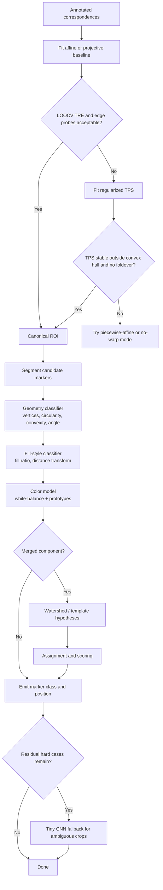

# Deep Research Report on a Stylized 2D Sports UI Marker Extraction Pipeline

## Executive Summary

For a Python-first pipeline that warps stylized sports-UI screenshots into a canonical frame and then classifies a very small vocabulary of marker shapes, the strongest default stack is: an affine or projective baseline first, then a regularized TPS fallback implemented with **scikit-image** or **SciPy**, followed by a mostly classical classifier built from contour geometry, fill-style features, and stabilized team-color models. In 2026, `scikit-image.transform.ThinPlateSplineTransform` is the cleanest dedicated TPS “transform object” in mainstream Python docs, while `scipy.interpolate.RBFInterpolator` is the best general-purpose RBF option if you want smoothing, kernel alternatives, or neighbor-limited evaluation. The Python binding around OpenCV’s TPS transformer remains the riskiest production default because the official docs expose the API, but long-running Python issues still affect `applyTransformation`, and a separate 4.10 wheel regression removed `createThinPlateSplineShapeTransformer()` for some users. For classification, simple geometric rules plus fill-ratio and distance-transform features are more decision-efficient than a CNN for clean masks; a tiny CNN only becomes attractive if stylization, aliasing, overlap, or color/fill ambiguity make handcrafted logic brittle. citeturn6view0turn38view0turn26view0turn28view0turn28view1turn35view0turn34view0turn32search7turn22search6

Validation should be built around holdout **TRE** rather than in-sample fit, because registration literature and SimpleITK’s own registration-error guidance emphasize that **TRE is the quantity of interest**, **TRE is spatially varying**, and **FRE should not be treated as a proxy for TRE**. In practice, that means leave-one-landmark-out error, exterior/edge probes, and explicit warp sanity checks should gate whether you keep TPS, downgrade to piecewise-affine or affine, or run a “no-warp” fallback. Public prior art closest to your project is not in EASHL OCR specifically; the strongest analogues I found were community EASHL/Pro Clubs trackers that usually rely on undocumented APIs and game-minimap detectors in games like entity["video_game","League of Legends","moba video game"] that detect tiny known icons with classical CV and small neural nets. I did not find a public, well-documented project specifically extracting EA NHL Action Tracker rink-position glyphs with a non-rigid warp + contour-classification pipeline, which suggests your exact niche is still relatively open. citeturn36view0turn14view0turn14view4turn15search1turn14view3turn12search3turn12search7turn12search11

## Methodology

This report was built from a source hierarchy favoring current official documentation, package indexes, original papers, and then public community artifacts when official material did not exist. Package maturity was evaluated using current package pages, current docs, and issue trackers; algorithm recommendations were then filtered through your intended use case: sparse landmarks, small stylized markers, CPU-friendly Python, and a need for decision-quality engineering guidance rather than purely theoretical optimality. citeturn31view0turn29view2turn29view1turn30view0turn29view3

As of May 2026, the most relevant packages I verified were **SciPy 1.17.1**, **scikit-image 0.26.0**, **opencv-contrib-python 4.13.0.92**, **thin-plate-spline 1.2.2**, and **SimpleITK 2.5.4**. The current scikit-image install docs also state that the “current” scikit-image requires at least Python 3.11. citeturn31view0turn29view2turn7search17turn29view1turn30view0turn29view3

Assumptions and unspecified constraints used in this synthesis:

- The warp is estimated from roughly 10–20 reliable 2D correspondences and applied to relatively small, stylized UI markers.
- The target deformation is smooth but not arbitrarily elastic; extreme out-of-plane perspective or severe occlusion was not stated.
- “Production-grade” is interpreted as: installable on current Python, documented, maintained recently, and reasonably debuggable in a Python workflow.
- Public-community search was limited to openly discoverable web artifacts; closed Discord tools, private league software, and unpublished scripts may exist but were not observable.

## Findings

**A. Warp model choices**

**A1. TPS implementation choices**

**Finding:** For your use case, the best default dedicated TPS implementation in Python today is scikit-image’s TPS transform, not OpenCV’s Python shape transformer. `scikit-image.transform.ThinPlateSplineTransform` is documented as a 2D TPS transform with a callable transform and an `inverse` property, while `PiecewiseAffineTransform` is also documented with forward and inverse mappings. `scipy.interpolate.RBFInterpolator` is strong when you want TPS as one kernel among several kernels, explicit smoothing, vector-valued outputs, and neighbor-limited evaluation, but it is not a “transform object” with a built-in inverse interface. OpenCV’s TPS API is documented for `estimateTransformation`, `applyTransformation`, and `warpImage`, yet the Python ecosystem still shows a long-open `applyTransformation` bug and a separate packaging regression where the factory disappeared from some 4.10 wheels. Meanwhile, the lightweight `thin-plate-spline` PyPI package is current and simple, but PyPI still classifies it as Beta and it appears to have a single maintainer. citeturn6view0turn5view0turn38view0turn26view0turn27view0turn28view0turn28view1turn30view0

**Why it matters:** If you need predictable point mapping and inverse-map image warping inside Python, scikit-image is the cleanest default. If you need regularization and kernel experimentation, SciPy is stronger. If you only need raster warping in an OpenCV-heavy stack, OpenCV can still be usable, but it is the highest-risk default for Python-specific production stability.

**Confidence/applicability:** High for Python CPU pipelines with sparse manual landmarks.

**Primary sources:** urlscikit-image TPS docsturn1search0, urlscikit-image transform APIturn3view2, urlSciPy RBFInterpolator docsturn1search1, urlOpenCV TPS docsturn0search1, urlOpenCV Python issue on missing TPS factoryturn0search9, urlOpenCV contrib issue on applyTransformation bugturn1search10, urlthin-plate-spline PyPIturn0search3

**A2. Alternatives to TPS**

**Finding:** The strongest alternatives for sparse landmark warping are, in order of practical usefulness here: affine/projective baselines, piecewise-affine warps, TPS, and B-spline-style registration if you already live in an ITK/SimpleITK stack. QGIS’s transformation guidance is useful as a practical reference: affine-like models preserve straight lines and are stable baselines; higher-order polynomials can curve straight lines and distort edges when extrapolated; TPS “rubber sheets” to match control points while minimizing overall curvature, but can still introduce strong local deformations if the control points themselves are noisy. scikit-image’s piecewise-affine transform is explicitly triangle-mesh based with inverse affine transforms per triangle, making it strong when the distortion is local and you want deterministic local control. SimpleITK’s landmark initializer explicitly supports transforms including BSplineTransform, which makes B-splines viable if you want a registration-style framework, though that is usually heavier than necessary for 10–20 UI landmarks. The classical moving-least-squares literature remains attractive conceptually for smooth local deformations, but the practical Python ecosystem around MLS is not as standardized as SciPy/scikit-image for this exact task. citeturn37view1turn37view2turn5view0turn24search2turn24search8turn2search0

**Why it matters:** If your residuals after affine/projective are mostly global, TPS is appropriate. If the errors are local and you care more about local fidelity than global smoothness, piecewise-affine is often a safer fallback. B-splines are best reserved for heavier registration stacks.

**Confidence/applicability:** High for affine/TPS/piecewise-affine guidance; medium for MLS-specific package maturity.

**Primary sources:** urlQGIS georeferencer transform guidanceturn20search12, urlscikit-image PiecewiseAffine docsturn3view2, urlSimpleITK landmark registration docsturn24search2, urlITK landmark initializer docsturn24search1, urlMLS image deformation paperturn2search0

**A3. Preferable packages in 2026**

**Finding:** My ranking for a production Python stack in 2026 is: **scikit-image TPS** for the cleanest dedicated geometric-transform API; **SciPy RBFInterpolator** when you need TPS plus smoothing or non-TPS kernels; **SimpleITK** only if you already use registration tooling; **thin-plate-spline** when you want a small and understandable NumPy/SciPy dependency; and **OpenCV TPS** only when you specifically want its raster warp path and are prepared to pin/test the exact wheel version you deploy. The reason is not just algorithm quality but combined maturity: SciPy, scikit-image, and opencv-contrib-python all show current releases; thin-plate-spline is current but still Beta and singly maintained; and SimpleITK is current but comparatively heavyweight for a tiny UI-warp problem. citeturn31view0turn29view2turn29view1turn30view0turn29view3turn28view0turn28view1

**Why it matters:** In this problem, debugging and deployment risk are likely to dominate raw theoretical differences among TPS implementations.

**Confidence/applicability:** High.

**Primary sources:** urlSciPy PyPIturn0search8, urlscikit-image PyPIturn7search1, urlopencv-contrib-python PyPIturn7search0, urlthin-plate-spline PyPIturn0search3, urlSimpleITK package pageturn29view3

**B. Validation and failure modes**

**B4. How to evaluate transform quality**

**Finding:** Use **holdout TRE** as the main quantitative criterion, not just in-sample fit. SimpleITK’s registration-error notebook is explicit: TRE is the quantity of interest, FRE should not be used as a surrogate for TRE, TRE is spatially varying, and least-squares paired-point registration is sensitive to outliers. For your pipeline, a good practical rubric is: (1) in-sample landmark RMSE as a sanity check only, (2) leave-one-landmark-out TRE for every control point, (3) “probe TRE” at boundary and exterior anchor points if you have any manually observed correspondences there, (4) warp-grid visualization, and (5) invalid-warp checks such as triangle flips, locally absurd displacement, or strong drift outside the convex hull. QGIS’s georeferencer reporting is also instructive because it includes residual images and per-GCP RMS values, which is exactly the type of artifact you want for debugging. citeturn36view0turn37view2turn38view0

**Why it matters:** A warp that fits its training points perfectly can still be bad where you actually need to detect markers.

**Confidence/applicability:** High.

**Primary sources:** urlSimpleITK registration errors notebookturn21search19, urlQGIS georeferencer docsturn20search12, urlSciPy RBFInterpolator docsturn1search1

**B5. When thin-plate-like regularization is actually needed**

**Finding:** Use affine/projective first, then add TPS if you still see structured local residuals. TPS is justified when a rigid, similarity, affine, or projective model leaves systematic local misalignment after reasonable landmark placement. Regularization is especially important when landmarks are hand-clicked or noisy: OpenCV explicitly exposes a TPS regularization parameter (`beta`), and SciPy explicitly states that smoothing controls the transition between exact interpolation and a polynomial least-squares fit. QGIS’s documentation adds an important practical warning: unlike the other transformation families, TPS matches all control points exactly, which is helpful when the correspondences are trustworthy but can introduce large deformations between nearby GCPs when the correspondences have registration error. citeturn27view3turn38view0turn37view1

**Why it matters:** If your landmarks are imperfect, “exactly fitting them” is not the same as “best recovering the underlying UI geometry.”

**Confidence/applicability:** High.

**Primary sources:** urlOpenCV TPS docsturn0search1, urlSciPy RBFInterpolator docsturn1search1, urlQGIS transform guidanceturn20search12

**B6. Fallbacks when the warp is bad**

**Finding:** The cleanest failure policy is a tiered cascade: **affine/projective baseline → regularized TPS → piecewise-affine local warp → no-warp detection mode**. Gate each stage with a small set of measurable checks: LOOCV TRE below threshold, bounded exterior drift, no foldovers, and shape priors remaining plausible after warping. When a single landmark acts like an outlier, the registration literature says least-squares paired-point fitting can degrade badly, so a cheap outlier screen is to refit while omitting each point once and look for the point whose omission dramatically reduces TRE. If that happens, demote the point or reduce model flexibility. citeturn36view0turn37view1turn5view0

**Why it matters:** This prevents one bad click or one malformed screenshot from poisoning the entire detection pass.

**Confidence/applicability:** High.

**Primary sources:** urlSimpleITK registration errors notebookturn21search19, urlQGIS transform guidanceturn20search12, urlscikit-image PiecewiseAffine docsturn3view2

**C. Shape descriptors and shape classification**

**C7. Best geometric descriptors after segmentation**

**Finding:** For a four-class vocabulary like circle, square, triangle, and diamond, a transparent rule stack will usually outperform heavier shape descriptors on engineering efficiency: use `approxPolyDP` vertex count, convexity, circularity \((4\pi A/P^2)\), extent/solidity, and orientation from `minAreaRect` or second moments. OpenCV and scikit-image expose exactly the primitives you need: contour approximation, contour area, arc length, convex hull, rotated minimum-area rectangles, and region orientation/solidity. Hu moments remain a good backup or feature vector when you want a compact invariant signature, but for tiny stylized masks they are often less interpretable than explicit geometric ratios. Zernike moments are theoretically attractive because the literature consistently treats them as stronger global orthogonal descriptors with good robustness to noise/deformation, but for a tiny fixed class set they are better as a second-line fallback than as the first classifier you build. citeturn35view0turn34view0turn34view1turn34view2turn32search0turn33view0turn32search7

**Why it matters:** You only need enough representation power to separate four very simple shapes, and the simplest discriminative stack is easier to debug and trust.

**Confidence/applicability:** High.

**Primary sources:** urlOpenCV contour features tutorialturn9search12, urlscikit-image regionprops docsturn9search2, urlHu original paperturn32search0, urlMahotas Zernike docsturn32search7, urlZernike robustness paperturn10search5

**C8. Are invariant moments or orthogonal moments warranted?**

**Finding:** Yes, but as backups, not as your first weapon. Hu moments are easy to compute and rotation/scale/translation invariant by construction, which makes them useful as a lightweight fallback after your simpler contour rules. Zernike moments are richer and the literature describes them as more robust to noise and deformations than many other moment families, but they are still global descriptors; they lose some of that edge when the icons are tiny, antialiased, partially merged, or differentiated mainly by fill style rather than silhouette. For your setup, I would only add moments after a rule-based baseline and only if real validation data shows that handcrafted geometry is unstable. citeturn32search0turn33view0turn32search7

**Why it matters:** This keeps complexity proportional to the actual class vocabulary.

**Confidence/applicability:** High for Hu-as-backup; medium for Zernike value on very tiny crops.

**Primary sources:** urlHu original paperturn32search0, urlMahotas Zernike docsturn32search7, urlZernike robustness paperturn10search5

**C9. Distinguishing a 4-vertex square from a rotated diamond**

**Finding:** Four vertices alone are not enough; orientation is the deciding feature. OpenCV’s rotated minimum-area rectangle returns center, width, height, and angle, while scikit-image’s region orientation returns the angle of the major axis from second moments. The practical rule is: if a convex four-vertex polygon has near-equal side lengths and near-right interior angles, classify it as “square-family,” then separate **square** vs **diamond** by angle relative to the canonical UI axes: near 0°/90° means square, near 45° means diamond. `minAreaRect` is generally the better operational choice for tiny UI glyphs; second-moment orientation is a useful cross-check but becomes less stable as the shape approaches isotropy. citeturn35view0turn34view0

**Why it matters:** This lets you keep the classifier symbolic and deterministic instead of learning a class boundary you already understand geometrically.

**Confidence/applicability:** High.

**Primary sources:** urlOpenCV contour features tutorialturn9search12, urlscikit-image regionprops docsturn9search2

**D. Fill-style classification**

**D10. Solid vs outlined versions of the same contour**

**Finding:** The most practical features are **fill ratio**, **normalized distance-transform statistics**, and **radial occupancy**, not more sophisticated descriptors. scikit-image exposes properties like `area_filled`, `extent`, and `solidity`, which are natural building blocks for fill-based rules. In practice, for a solid disk or triangle, an eroded interior still contains substantial foreground, whereas an outline shape quickly collapses. A strong two-feature baseline is: (1) foreground area divided by filled-contour area, and (2) max or median distance-transform value normalized by the equivalent radius or box size. That pair is usually more stable under JPEG blur than raw pixel counts alone. This specific micro-glyph problem is not well covered in the literature I found, so that recommendation is an engineering inference built on standard region-measurement primitives. citeturn34view1turn34view2

**Why it matters:** Fill style is often the one attribute that silhouette-only classifiers cannot recover.

**Confidence/applicability:** Medium-high; the underlying features are standard, but the exact thresholding policy needs a validation set.

**Primary sources:** urlscikit-image regionprops docsturn9search2

**D11. Robust fill-style classification under color/binarization drift**

**Finding:** Compute fill style from a normalized shape mask, not from raw RGB. The recommended sequence is: stabilize color first, obtain a mask for the candidate marker, clean it with tiny morphology, then measure fill ratio and distance-transform statistics on the cleaned mask. If antialiasing is strong, a soft occupancy score over grayscale alpha-like intensity can be more robust than a single hard threshold. If you need a very compact rule, “interior occupancy after erosion” is often enough: outlined glyphs lose most of their mass under modest erosion, while solid glyphs retain it. Again, I did not find a canonical paper specific to this exact game-UI problem; this is a practical CV recommendation rather than a literature consensus. citeturn34view1turn34view2

**Why it matters:** It decouples a style decision from color/compression artifacts that should not define the class.

**Confidence/applicability:** Medium-high.

**Primary sources:** urlscikit-image regionprops docsturn9search2

**E. Color inference and stabilization**

**E12. Can team side color be inferred automatically?**

**Finding:** Yes, and it is a good idea if you keep a manual override. The most practical approach is to infer a small per-team color prototype set from the first confident detections or from fixed UI regions, using white-balance normalization and then dominant-color extraction. OpenCV documents a gray-world white-balance implementation, and its k-means tutorial gives you the standard quantization step you need to extract dominant colors. For classification, a hybrid strategy is best: threshold in HSV when you want a cheap first pass, but maintain more stable color prototypes in a perceptual space such as LAB/LCh or a prototype-based color-distance representation. The modern color-recognition literature under challenging lighting also reinforces that illumination variation materially changes raw color detection performance, so explicit normalization is worth it. citeturn17search0turn19search9turn18search19turn17search2

**Why it matters:** Team-color inference can remove a lot of manual configuration, but only if you treat illumination/compression as a first-class source of error.

**Confidence/applicability:** Medium-high.

**Primary sources:** urlOpenCV GrayworldWB docsturn17search0, urlOpenCV k-means tutorialturn19search9, urlOpenCV inRange HSV tutorialturn18search19, urlColor recognition under challenging lighting paperturn17search2

**E13. Stabilizing color against compression and lighting**

**Finding:** The recommended stabilization stack is: crop a candidate ROI, apply white-balance normalization, convert to HSV or LAB-like coordinates, sample the interior rather than the edges, and classify color by nearest prototype instead of raw-threshold-only logic. Gray-world is a simple and well-documented baseline for white balance. Sampling the eroded interior matters because JPEG artifacts and antialiasing disproportionately corrupt edges. For orange/red/blue, a prototype-distance approach is more stable than a single hard threshold because orange vs red is exactly the kind of class split that compression and illumination can perturb near the hue boundary. citeturn17search0turn18search19turn17search2

**Why it matters:** A slightly better color model upstream reduces downstream pressure on the shape and fill classifiers.

**Confidence/applicability:** Medium-high.

**Primary sources:** urlOpenCV GrayworldWB docsturn17search0, urlOpenCV inRange HSV tutorialturn18search19, urlColor recognition under challenging lighting paperturn17search2

**F. Tiny CNN option**

**F14. Would a tiny CNN be sensible?**

**Finding:** A tiny LeNet-style CNN is technically sensible, but it should not be your starting point. The historical LeNet family is small enough to train quickly, and the broader small-data literature is clear that deep models face real overfitting risk when data are limited. For your task, a tiny CNN becomes worth the annotation/augmentation cost only if real screenshots show that rule-based geometry + fill + color still leave a non-trivial error floor. As an engineering estimate, a 32×32 or 48×48 four-class LeNet-like model with tens of thousands of parameters is easy to train in minutes once you have roughly 1k–5k augmented labeled crops, and inference latency per icon is operationally tiny on modern CPUs. If you only have a few hundred real crops, the classifier will likely need strong augmentation and careful validation to be trustworthy. citeturn22search0turn22search6turn23search10

**Why it matters:** A CNN may eventually reduce hand-tuning, but it creates a labeling and monitoring obligation that classical geometry does not.

**Confidence/applicability:** Medium-high on the strategic recommendation; medium on the time/size estimates, which are clearly engineering estimates rather than task-specific benchmarks.

**Primary sources:** urlLeNet paperturn22search0, urlSmall-data ML reviewturn22search6, urlBinary shape CNN paperturn23search10

**G. Overlap handling and public prior art**

**G15. Handling overlap zones or touching markers**

**Finding:** The best classical strategy is a **hybrid** one: direct connected-component classification for easy cases, then an ambiguity branch for merged components. OpenCV’s marker-based watershed is the default tool for touching-object separation, especially when supported by a distance transform. After generating candidate sub-instances, use a bipartite assignment solver such as SciPy’s `linear_sum_assignment` to assign hypotheses to expected marker slots or template matches. For known tiny icons, template matching is also useful, especially when paired with thresholding and non-max suppression, but it works best when the icon family is rigid and only mildly overlapped. Iterative “detect best template, subtract, repeat” is reasonable for light overlap and a tiny template library, but it will accumulate errors faster than watershed/template-hypothesis methods once overlaps become heavy or masks become poor. citeturn11search0turn11search1turn12search0turn11search15turn12search6

**Why it matters:** You should not force the same segmentation/classification path to solve both single-instance and merged-instance cases.

**Confidence/applicability:** High for watershed + assignment; medium for iterative subtraction, which is highly data-dependent.

**Primary sources:** urlOpenCV watershed tutorialturn11search0, urlSciPy linear_sum_assignment docsturn11search1, urlOpenCV template matching tutorialturn12search0, urlDistance-transform watershed referenceturn11search15

**G16. Community projects or prior art**

**Finding:** The discoverable public ecosystem splits into two relevant families. First, EASHL/Pro Clubs communities commonly build around undocumented or semi-public APIs rather than OCR/CV: a 2024 EASHL blog post explicitly describes EA EASHL APIs as internal and undocumented, Reddit threads discuss changing NHL API calls, and public trackers such as ChelHead and Chelstats advertise richer club/player stats than the official surfaces expose. Second, the closest CV analogues are game-minimap projects such as the OpenCV-based champion detection repo/blog and a League minimap scanner that combines image processing with a neural-network evaluation stage. I did **not** find a public, well-documented project specifically extracting EA NHL Action Tracker rink-position glyphs from screenshots with a non-rigid registration + contour-analysis pipeline. In the public web slice I could verify, community effort is concentrated more on API-backed stats sites than on screenshot-based marker extraction. citeturn14view0turn14view4turn14view1turn15search1turn14view3turn12search3turn12search7turn12search11

**Why it matters:** Your most direct “prior art” is likely conceptual rather than domain-identical: undocumented-game-API tracking on one side, tiny-known-icon CV on the other.

**Confidence/applicability:** Medium-high. Public-web coverage is strong enough to establish the pattern, but not to guarantee that no private or undiscoverable project exists.

**Primary sources:** urlRavi Bhagwat EASHL API blogturn13search0, urlChelHeadturn13search4, urlChelstats repoturn15search1, urlEASHL API Reddit threadturn13search12, urlLeague minimap detection blogturn12search3, urlLeague minimap detection repoturn12search7, urlLeague minimap scanner repoturn12search11

## Comparisons and Tables

| Decision area | Default choice | When to switch | Main tradeoff |
|---|---|---|---|
| Global alignment | Affine or projective baseline | If residuals are locally structured | Much safer extrapolation, but cannot absorb local bends |
| Non-rigid warp | scikit-image TPS or SciPy TPS-RBF | If local distortions remain after affine/projective | More expressive, but more sensitive to noisy landmarks |
| Local warp fallback | Piecewise-affine | If edge/local regions need tighter local control | Strong local control, less smooth globally |
| Shape classification | Vertex count + circularity + convexity + orientation | If masks are messy or stylized | Fast, transparent, debuggable |
| Fill-style classification | Fill ratio + normalized distance-transform stats | If thresholds drift by team/color | Needs stable mask extraction |
| Color inference | White balance + dominant-color prototypes | If manual color config is too brittle | Extra state/tracking logic |
| Overlap handling | Watershed + assignment only on ambiguous components | If merged components are common | More code complexity, but avoids polluting easy cases |
| CNN | Last-stage fallback | If real data defeats rules | Higher labeling and monitoring burden |

The comparison above is synthesized from the current SciPy, scikit-image, OpenCV, SimpleITK, and QGIS documentation plus the OpenCV Python issue history. The strongest evidence-backed distinctions are: scikit-image’s clean transform interfaces, SciPy’s smoothing/kernel flexibility and quadratic memory growth with point count, OpenCV’s Python binding risks, and QGIS/SimpleITK’s practical framing of when flexible warps help vs. when they misbehave. citeturn6view0turn5view0turn38view0turn26view0turn27view0turn28view0turn28view1turn37view1turn36view0

| Public artifact | Modality | Relevance to your pipeline |
|---|---|---|
| urlChelHeadturn13search4 | EASHL web tracker | Strong evidence that community demand exists for richer NHL/EASHL telemetry |
| urlChelstats repoturn15search1 | EASHL API-backed app | Shows community preference for exposed/undocumented APIs over OCR |
| urlRavi Bhagwat EASHL API blogturn13search0 | API reverse-engineering | Best public explanation of undocumented-EA-endpoint fragility |
| urlProclubs.ioturn13search3 | EA FC tracker | Cross-title evidence that club-stat tooling often follows the API path |
| urlLeague minimap detection blogturn12search3 | Classical CV on tiny known icons | Closest public analogue to your marker-detection problem |
| urlLeague minimap detection repoturn12search7 | OpenCV minimap detector | Practical example of screenshot-driven tiny-icon detection |
| urlLeague minimap scanner repoturn12search11 | CV + small NN | Good analogue for a hybrid classical/deep fallback design |

Taken together, these artifacts support a clear inference: around urlElectronic Artshttps://www.ea.com titles, the public community usually chooses APIs if they are reachable, and chooses screenshot CV mainly in miniature-icon interfaces such as minimaps, not in EASHL Action Tracker extraction specifically. citeturn14view0turn14view1turn15search1turn14view3turn12search3turn12search7turn12search11

## Visualizations

The diagram below shows the recommended decision flow: start simple, validate with holdout error, then add flexibility only where justified. That structure is directly motivated by the registration guidance on TRE/FRE, by QGIS’s practical transform tradeoffs, and by the current maturity of the Python libraries discussed above. citeturn36view0turn37view1turn6view0turn38view0turn28view1

## Conclusions and Recommended Next Steps

The strongest decision-oriented recommendation is to **build this as a classical, confidence-gated pipeline first**:

1. **Implement three warp models only:** affine/projective baseline, regularized TPS, and piecewise-affine fallback.  
2. **Evaluate them with LOOCV TRE plus edge/exterior sanity probes**, not just in-sample landmark fit.  
3. **Classify markers with explicit geometry + fill-style + color logic first**, because your class vocabulary is tiny and interpretable.  
4. **Route only ambiguous merged components into an overlap branch** using watershed/template hypotheses and assignment.  
5. **Defer a CNN until the validation set proves you need it.** citeturn36view0turn37view1turn35view0turn11search0turn11search1turn22search6

A crisp implementation recommendation for a Python stack in 2026 is:

- **Warping:** prefer urlscikit-image TPS docsturn1search0 or urlSciPy RBFInterpolator docsturn1search1; keep urlOpenCV TPS docsturn0search1 as a conditional option, not the default.
- **Descriptors:** use urlOpenCV contour features tutorialturn9search12 + urlscikit-image regionprops docsturn9search2.
- **Color stabilization:** use urlOpenCV GrayworldWB docsturn17search0 + prototype-based color modeling.
- **Overlap handling:** use urlOpenCV watershed tutorialturn11search0 + urlSciPy linear_sum_assignment docsturn11search1.
- **Fallback learning:** prototype a tiny LeNet-style model only after you have a real hard-example corpus. citeturn6view0turn38view0turn35view0turn34view0turn17search0turn11search0turn11search1turn22search0

**Potential artifacts to generate next:**

- A warp-benchmark notebook that outputs in-sample RMSE, LOOCV TRE, and warp-grid overlays for affine/TPS/piecewise-affine.
- A small gold set of 100–200 labeled screenshots covering teams, lighting/compression variation, and overlap edge cases.
- A descriptor-ablation notebook comparing geometry-only vs. geometry+fill vs. geometry+fill+color.
- A “hard cases” crop bank reserved for deciding whether the CNN fallback is justified at all.

If you must pick one single near-term path, the best one is: **affine baseline + regularized TPS comparison, then classical marker classification, with overlap logic added only after single-marker performance is strong.**