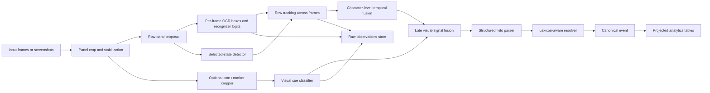
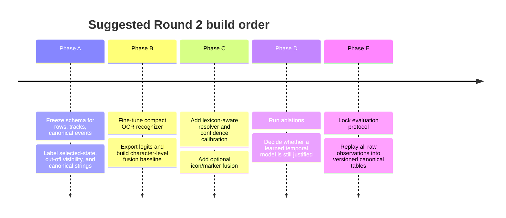

# Multi-Frame Event-List OCR with Visual Signal Fusion for Round 2

## Executive summary

The Round 2 brief defines a shift from single-frame OCR to **multi-frame event-list extraction** on the Action Tracker UI, with explicit emphasis on cross-frame consensus, fuzzy string recovery, selected-state exploitation, cut-off row handling, and visual-signal fusion. The companion brief on marker extraction establishes that the same UI also carries structured visual cues on the rink diagram, including event type, team side, and selected-state highlighting, which makes a fused text-plus-visual pipeline technically well motivated rather than speculative. fileciteturn0file1L1-L39 fileciteturn0file0L5-L27

The highest-confidence conclusion from recent literature is that Round 2 should be framed as **tracking-by-detection over short UI row sequences**, not as generic single-image OCR and not as an end-to-end multimodal-LLM problem. Recent video text spotting work has moved toward either unified trackers with temporal reasoning such as CoText, TransDETR, and VimTS, or modular systems that combine a strong image text spotter with track-level association and uncertainty-aware correction, as in GoMatching and the conformal CVTS framework. Meanwhile, MME-VideoOCR shows that even strong multimodal video models still degrade on tasks that require robust cross-frame integration, holistic temporal reasoning, and resistance to blur and truncation. citeturn19search0turn19search6turn35search1turn34view0turn16search0turn16search2

For this task, the best near-term architecture is a **modular stack**: panel crop and stabilization, row proposal and row tracking, per-frame OCR with a recognizer that exposes token logits, track-level temporal fusion, late fusion with selected-state and icon/scene cues, and a final structured-event resolver that combines calibrated OCR confidence with lexicon-aware fuzzy matching. This preserves debuggability, works with modest annotation budgets, and matches the direction of the strongest recent video text systems, especially GoMatching plus uncertainty-aware post-processing and VLSpotter-style visual/semantic refinement. citeturn19search6turn34view0turn20search1turn22search0turn22search1

The main constraint is that the **Round 2 dataset is not yet fully specified**. From the provided brief, the task definition, known failure modes, and desired outputs are clear, but essential benchmark properties are not: dataset size, clip duration, frame rate, train/validation/test splits, annotation schema, public availability, and any quantitative Round 1 scores or leaderboards. That means the report can propose a rigorous benchmark design, but it cannot responsibly claim official dataset totals or public baseline numbers beyond the internal qualitative notes already present in the brief. fileciteturn0file1L11-L18

## Source basis and what Round 2 currently specifies

The primary brief already gives a strong problem definition. It says the current system works on Action Tracker screen content, that tags are usually the more stable text field while player names are less common and harder, that OCR confusions are dominated by a known short list of character substitutions, and that the selected state is visually meaningful and likely useful for grouping or disambiguation. It also states that Round 1 already established several operational facts: single-frame OCR can work sometimes, but it drops or fractures rows; row order matters; and selected-state information is likely worth exploiting in Round 2. fileciteturn0file1L11-L18

The companion marker brief matters because it expands the information budget of the screen. It specifies that the UI includes stylized rink markers whose **shape encodes event type**, **fill style encodes home/away side**, and **yellow glow encodes selection**. Even though that brief focuses on rink-marker extraction rather than list OCR, it strongly suggests that Round 2 should not treat the event list as an isolated OCR problem. A properly designed fusion stage can use these visual cues as corroborating evidence for event type, team side, and selected-row alignment. fileciteturn0file0L5-L27

Publicly, the EA ecosystem already exposes structured club, player, and recent-match information on Pro Clubs pages, and community trackers such as ChelHead focus on club/player lookups, comparisons, and automatic match tracking. I did **not** identify public work that clearly targets the Action Tracker event list itself or a public benchmark that mirrors the Round 2 task. The practical implication is that OCR-based extraction is still defensible if the goal is **event-level chronology or UI-only metadata** not already exposed on public stats pages. citeturn36view0turn14search18turn12search12

The table below distinguishes what is currently specified for Round 2 from what is still missing and should be formalized before benchmarking.

The contents of this table come from the two uploaded briefs. fileciteturn0file1L1-L39 fileciteturn0file0L5-L27

| Aspect | Present in brief | Still missing for a benchmark |
|---|---|---|
| Core task | Multi-frame event-list OCR with cross-frame consensus | Formal task statement with input/output schema |
| Known signals | Text rows, selected state, row order, fuzzy confusions | Exact location and persistence rules for each signal |
| Auxiliary visual cues | Rink-marker event type, side, selected glow | Explicit linkage between list rows and markers |
| Round 1 knowledge | Qualitative internal lessons and baseline heuristics | Quantitative metrics, score table, error breakdown |
| Annotation scope | Implied row text and event outputs | Canonical event IDs, per-frame row boxes, track IDs, visibility flags |
| Dataset definition | None public identified | Frame count, clip count, fps, resolutions, split policy, release policy |

A practical **minimum annotation schema** for Round 2 should include: `clip_id`, `frame_id`, `row_box`, `row_track_id`, `selected_flag`, `visibility_fraction`, `cutoff_left/right/top/bottom`, raw row transcription, canonical player/tag strings, event type, team side, time label, period, link-to-marker if visible, and a Boolean for whether the field is lexicon-constrained. Without these labels, it will be hard to separate OCR error from temporal fusion error from parser error during ablation. This is an inference from the task design and from how recent video text benchmarks separate detection, tracking, and recognition. citeturn20search11turn34view0turn19search6

## Recent literature and the most relevant public datasets

Recent work on video text has converged on a few ideas that are directly relevant here. CoText showed that a lightweight end-to-end video text spotter can gain from contrastive long-range temporal information while remaining real-time. VLSpotter added a more explicitly fused design: text-focused super-resolution for motion blur, linguistic reasoning through a language model, and semantic reasoning for better text consistency. TransDETR and GoMatching pushed the field toward stronger transformer-based temporal association and matching-based tracking, while VimTS emphasized that image/video joint training and synthetic video generation can improve cross-domain robustness. CVTS then showed that a surprisingly effective improvement is to keep a strong base system and add **uncertainty-aware temporal correction** across tracks, rather than trying to learn everything end-to-end. citeturn19search0turn20search1turn19search6turn34view0turn35search1

One of the most important findings for Round 2 is negative rather than positive: large multimodal video models are still not a drop-in answer. MME-VideoOCR evaluates 18 state-of-the-art multimodal models and reports that even the best model reaches only 73.7% accuracy overall, with clear weaknesses in spatio-temporal reasoning and cross-frame information integration. That is a strong argument for keeping Round 2 as a domain-specialized OCR-and-fusion pipeline unless the dataset later becomes large enough to support end-to-end video-language fine-tuning. citeturn16search0turn16search2

For visual-semantic fusion inside text recognition itself, the most relevant recent single-image scene text papers are MATRN and HVSI. Both support the same design principle: text recognition improves when visual features and semantic priors interact rather than staying fully separate. In Round 2 terms, that supports late or intermediate fusion of row appearance, selected/highlight cues, icon class probabilities, and lexicon priors, instead of a pure OCR-only stack. citeturn22search0turn22search1

The public dataset landscape is useful mainly for **method transfer**, not direct benchmark substitution. DSText v2 is the closest modern benchmark in spirit because it explicitly targets dense and small video text and includes game/sports-style scenarios; BOVText is valuable because it is large, bilingual, and open-world; MME-VideoOCR is useful as a difficulty benchmark for multi-frame OCR reasoning; and VimTS contributes a synthetic video text dataset precisely to improve cross-domain video text generalization. None of these are a perfect match for Action Tracker row OCR, but they are the right external reference class. citeturn20search11turn1search9turn16search0turn35search1

The table below compares the most relevant datasets and benchmark resources.

Dataset statistics and task descriptions below are drawn from the cited dataset papers and the uploaded brief. citeturn1search9turn20search11turn16search0turn35search1 fileciteturn0file1L1-L39

| Dataset / resource | What it contains | Why it matters for Round 2 | Limitation for Round 2 transfer |
|---|---|---|---|
| Internal Round 2 brief | Multi-frame event-list OCR task with selected-state and fusion requirements | Direct task definition | No official dataset totals or annotation schema |
| DSText v2 | 140 video clips from 7 scenarios; dense/small video text spotting tasks | Best public analog for dense, small, temporally varying text; includes sports/game-like difficulty | Natural-scene video, not fixed game UI rows |
| BOVText | Large bilingual open-world video text dataset with many scenarios | Strong source for tracking and open-world robustness ideas | Much broader domain than short UI event rows |
| VimTS synthetic video data | Synthetic video text used for cross-domain generalization | Useful template for generating synthetic scrolling/blurred row sequences | Not an event-list benchmark |
| MME-VideoOCR | 1,464 videos, 2,000 QA pairs, 25 tasks in 44 scenarios | Strong evidence that cross-frame OCR remains difficult | Benchmark is reasoning-heavy, not row extraction |

The model families most worth transferring are summarized below.

The performance claims in this table come from the cited papers. citeturn19search0turn19search6turn20search1turn34view0turn35search1

| Model family | Main idea | Strength for Round 2 | Weakness for Round 2 |
|---|---|---|---|
| CoText | Lightweight end-to-end spotting with contrastive temporal learning | Good baseline for temporal consistency under real-time constraints | Harder to repurpose for structured row fields than a modular pipeline |
| VLSpotter | Visual SR + linguistic + semantic reasoning | Direct precedent for visual-signal fusion | More complex training stack |
| GoMatching | Strong image spotter plus long/short-term matching | Excellent fit for row-track consensus and modular deployment | Needs good per-frame proposals first |
| CVTS | Uncertainty-aware conformal calibration over a pretrained tracker | Ideal inspiration for confidence-aware multi-frame correction | Adds calibration stage and uncertainty bookkeeping |
| VimTS | Unified image/video training and synthetic data | Good long-term option for cross-domain robustness | Likely overkill unless Round 2 labels become much larger |

## Recommended pipeline architecture

The architecture I recommend is deliberately modular. Round 2 is better viewed as a **short-sequence structured extraction** task than as arbitrary video OCR. The pipeline should therefore fuse information at the level of **row tracks** and **field hypotheses**, not only at the final string level. That recommendation is consistent with GoMatching’s tracking-by-detection design, CVTS’s uncertainty-aware track correction, and VLSpotter’s explicit fusion of visual and semantic information. citeturn19search6turn34view0turn20search1turn22search0

### Data preprocessing and multi-frame alignment

Start with an **Action Tracker panel cropper** and a lightweight stabilizer. In a fixed UI, most of the value comes from panel localization, subpixel registration, and scroll-offset estimation, not from heavy scene understanding. Use phase correlation or ECC-based alignment on the panel crop to estimate global frame-to-frame translation, then fit row tracks inside the stabilized panel. Only after stabilization should OCR and selected-state inference run. This mirrors the value recent video text systems get from better temporal association before recognition fusion. citeturn19search6turn34view0

For row proposal, use a hybrid of UI priors and OCR priors: detect candidate row bands from repeated horizontal structure, OCR box density, and the selected/highlight region. The selected cue should be treated as a first-class signal, because the Round 2 brief already suggests it may help grouping and the companion marker brief shows selected-state is visually encoded elsewhere on the screen too. A good practical design is to have every row proposal carry `(y_center, height, selected_score, sharpness, visibility_fraction)`. fileciteturn0file1L11-L18 fileciteturn0file0L15-L16

For clipped or partially visible rows, do **track-first merging** rather than frame-first OCR. In other words, associate truncated rows across adjacent frames before asking the parser to finalize text. CVTS’s use of alignment across matched text instances is the right conceptual analog here: the system should fuse multiple partial views of the same row track instead of treating each frame as independent evidence. citeturn34view0

### Text detection and recognition

Use a strong practical OCR toolkit for the base recognizer, but make sure it exposes enough internals for temporal fusion. PaddleOCR is well suited for this because it provides trainable recognition models, including lightweight English and multilingual mobile recognizers, and practical deployment paths. PP-OCRv5 and the newer recognition module are especially relevant because they target difficult scene/document OCR while remaining compact enough for production. citeturn5search7turn5search8turn38view0

However, the default PaddleOCR CTC post-processing is **argmax best-path decoding**, not top-K temporal decoding. The official code path takes `preds.argmax(axis=2)` and `preds.max(axis=2)` before label decode, which is fine for ordinary OCR inference but leaves fusion performance on the table for Round 2. RapidOCR is a useful deployment layer because it packages PaddleOCR-derived ONNX models for fast offline inference across multiple runtimes, but out of the box it also presents a simple final-result API rather than a Round 2-specific top-K lattice interface. So the right move is to fine-tune with PaddleOCR-compatible recognizers, then add a **custom decoder over raw logits** for temporal fusion rather than relying only on stock OCR API outputs. citeturn25view0turn25view4turn24view2turn26view0

Field structure matters. The recognizer should not be a single unconstrained string model if the UI semantically contains different fields such as tag, player, minute/time, and event type. A robust production design is:

- one recognizer backbone with domain alphabet and short-text augmentations,
- separate parsers for time-like fields and name/tag-like fields,
- optional lexicon heads for roster-constrained names and team tags,
- and a downstream resolver that can decide whether a low-confidence track is better treated as “tag only,” “tag + truncated player,” or “full row.”

That is not directly copied from one paper; it is an implementation inference that combines practical OCR tool constraints with the structured-fusion direction in recent video text literature. citeturn20search1turn22search0turn34view0

### Temporal fusion strategies

The best baseline is **confidence-weighted voting over row tracks**, but not at the whole-string level. Whole-string majority voting fails whenever truncation or insertion/deletion errors dominate. The better baseline is a **character-level alignment-and-fusion** stage: align candidate strings in a row track with Needleman–Wunsch-style sequence alignment, pick the least uncertain character at each aligned slot, and preserve blanks or insertions when evidence is weak. This is directly supported by CVTS, which chooses low-uncertainty reference text, aligns tracked instances, and updates characters position-wise using the most confident observation. citeturn34view0

A sensible progression for Round 2 is three temporal-fusion tiers:

| Tier | Method | When to use it | Expected trade-off |
|---|---|---|---|
| Conservative baseline | Confidence-weighted vote over strings | Very small label budget | Fastest, easiest, weakest on clipped rows |
| Recommended default | Character-level alignment + uncertainty fusion | Most Round 2 settings | Best balance of gain vs complexity |
| Advanced | Tiny temporal transformer over row-track embeddings | Only after enough labeled tracks exist | Highest ceiling, weakest data efficiency |

RNNs and BiGRUs still have value here, especially if the dataset remains small. But recent public evidence suggests that the strongest modern performance gains come either from matching-and-fusion on top of an image OCR backbone or from transformer-style temporal models, not from pure recurrent temporal aggregation. For Round 2, I would use a **non-neural alignment-and-fusion baseline first**, then a small BiGRU or transformer only after ablation proves there is remaining temporal headroom. citeturn19search0turn19search6turn34view0turn35search1

### Visual-signal fusion

Visual-signal fusion should be **late-intermediate**, not fully early. The OCR stream and the visual cue stream have different failure modes and different resolutions, which matches a broader pattern also seen in newer OCR-context systems such as GLIMPSE and in visual-semantic STR work: text recognition needs high-resolution local evidence, while contextual reasoning can rely on coarser cues. citeturn21search5turn22search0turn22search1

In Round 2, the most valuable visual signals are:

- selected/highlight state of the row,
- optional icon class probabilities from any row-adjacent marker or list icon,
- row geometry and position in the panel,
- crop sharpness and motion/blur score,
- color-style features of the row or associated marker,
- and optional linkage to the rink marker stream when both are visible on the same screen. fileciteturn0file1L11-L18 fileciteturn0file0L10-L16

A practical fusion head should therefore consume:
`[OCR sequence score, OCR entropy, selected_score, row_visibility, row_y, icon_type_probs, team_side_probs, blur_score, lexicon_match_score, previous_track_consistency]`
and output a final score for each candidate field parse. A small MLP or gradient-boosted ranker is enough at first. This is a deliberate design choice: the literature supports the usefulness of multimodal interaction, but the likely labeling scale of Round 2 does **not** justify a very large end-to-end fusion model on day one. citeturn20search1turn22search0turn22search1turn16search0

### Post-processing and event-list extraction

The parser should produce both **raw observations** and a **canonical event**. Raw observations are frame-level or row-track-level facts, such as “frame 183 saw row_track 7 as `[TAG] PLA...` with entropy 0.34 and selected score 0.93.” Canonical events are the resolved structured outputs: tag, player, event type, minute/time, team side, and provenance. This separation is worth doing because immutable raw event storage plus replayable derived projections is a well-established pattern in event data systems and event sourcing. Snowplow’s atomic events model and general event-sourcing guidance both emphasize keeping an immutable event log and deriving read-optimized projections from it, which is exactly what Round 2 needs for reprocessing with better OCR or fusion later. citeturn31search2turn31search4turn31search5turn32search0turn32search1

A minimal storage model should include four tables:

| Table | Purpose |
|---|---|
| `raw_row_observation` | One record per frame-row hypothesis with OCR logits, strings, visual cues |
| `row_track` | Temporal aggregation of observations believed to be the same row |
| `canonical_event` | Final resolved event entity |
| `model_run` | Exact model versions, decoder settings, calibration version, and replay provenance |

This design enables safe backfills. If the decoder, lexicon, or fusion head changes, simply rerun projections from `raw_row_observation` rather than overwriting prior outputs. That also makes future rounds much easier to benchmark honestly. citeturn31search2turn31search16turn32search1turn30search0turn30search9

## Training regimen and practical implementation

The implementation order should be **data-first, then modular OCR, then fusion**. The fastest route to a strong result is not to build a large temporal model immediately. It is to label row tracks carefully, fine-tune a compact recognizer on the game UI alphabet, add uncertainty-aware temporal fusion, and only then ask whether a learned temporal model is still justified. That progression is consistent with both practical OCR tooling and recent video text spotting results. citeturn38view0turn19search6turn34view0

A good first supervised dataset for Round 2 is about **10k–30k labeled row crops** grouped into row tracks, not necessarily tens of thousands of full clips. Each tracked row should preserve full provenance: clean rows, clipped rows, blurred rows, selected rows, and rows with visual corroboration. Given the brief’s mention of very short tags and names with domain-specific spelling, synthetic generation should be part of training from the start: render roster-like names and tags in the game-like font style, then corrupt with motion blur, JPEG artifacts, gamma shifts, slight crop truncation, and highlight overlays before mixing with real labeled crops. This recommendation is an inference, but it is well aligned with VimTS-style synthetic video augmentation and with practical OCR training norms in PaddleOCR. citeturn35search1turn5search3turn38view0

For the recognizer, start from a compact PaddleOCR model and fine-tune with a domain alphabet. The official docs show that lightweight English recognition models remain very small, with `en_PP-OCRv5_mobile_rec` listed at 7.5 MB and `en_PP-OCRv4_mobile_rec` also at 7.5 MB, while older multilingual/mobile models are still comfortably deployable on CPU. That is ideal for iterative retraining and ablation. citeturn38view0

A concrete first-pass training recipe is:

| Component | Recommendation | Suggested starting hyperparameters |
|---|---|---|
| OCR recognizer | Fine-tune PP-OCRv5 or PP-OCRv4 mobile recognizer | AdamW, lr `3e-4`, weight decay `1e-4`, cosine decay, 20–50 epochs |
| Augmentations | Motion blur, JPEG 50–95, gamma shift, slight crop truncation, highlight overlay, horizontal jitter | 2–4 random corruptions per crop |
| Decoder | Custom top-K / logit export instead of pure argmax | Keep top `k=5` per time step for fusion experiments |
| Temporal fusion | Start with alignment + uncertainty; then BiGRU if needed | Context window `5–15` frames per row track |
| Fusion head | Small MLP over OCR and visual features | 2 layers, hidden sizes `128, 64`, dropout `0.1` |
| Lexicon matcher | Hybrid confidence + fuzzy-match scorer | Jaro-Winkler plus weighted edit distance; calibrate on held-out tracks |

The confidence calibration stage should be explicit. Scene-text recognizers are often overconfident, and the OCR calibration literature shows that post-hoc temperature scaling is a reasonable first calibration method at the sequence level, while more flexible methods should only be tried if sufficient held-out calibration data exists. CVTS further supports using uncertainty estimates to decide which frame-level predictions should dominate the track-level update. For Round 2, sequence-level temperature scaling on a held-out validation set is the right first step; isotonic regression should be reserved for later if calibration error remains high and the calibration set is large enough. citeturn7search2turn7search1turn34view0

For the icon or auxiliary visual classifier, start smaller than you think. A custom 3-layer CNN is often enough for a tiny four-class icon task, especially when the icons are standardized. If the icon domain turns out to vary more than expected, move to MobileNetV3-Small or EfficientNet-Lite0 transfer learning. MobileNetV3-Small is documented at about 2.54M parameters and 0.06 GFLOPS, which makes it a very safe default for edge-scale classification. EfficientNet-Lite is explicitly designed for mobile CPU/GPU/EdgeTPU deployment and can be quantized effectively. citeturn39view0turn39view1

The table below compares practical model choices for the major learnable components.

The model footprints below come from official docs where available; the expected Round 2 trade-offs are implementation recommendations. citeturn38view0turn39view0turn39view1turn24view2turn4search3

| Component | Candidate | Footprint / compute | Why choose it | Why not choose it |
|---|---|---|---|---|
| Base OCR | PP-OCRv5 mobile recognizer | ~7.5 MB class | Strong practical OCR baseline, easy fine-tune | Need custom decoder for top-K temporal fusion |
| Base OCR | PP-OCRv4 mobile recognizer | ~7.5 MB class | Simpler, well-tested, small | Lower ceiling than PP-OCRv5 |
| Runtime | RapidOCR + ONNX Runtime | Multi-runtime ONNX deployment | Fast offline inference, production-friendly | Not a training framework |
| Icon classifier | Tiny custom CNN | Very small, easiest to train | Strong if icon domain is rigid | May underfit if icon renderings vary |
| Icon classifier | MobileNetV3-Small | 2.54M params, 0.06 GFLOPS | Strong small transfer baseline | More setup than tiny CNN |
| Icon classifier | EfficientNet-Lite0 | Edge-oriented transfer model | Better accuracy/latency trade-off if dataset grows | Heavier than necessary for very rigid icons |
| Temporal fusion | Heuristic alignment + uncertainty | Minimal train cost | Best first production system | Limited ceiling if strong nonlinear effects dominate |
| Temporal fusion | Tiny transformer | Highest likely ceiling | Good once labeled row tracks are abundant | Harder to train, easier to overfit |

A simple rollout plan is below.

## Evaluation plan, ablations, and error analysis

The evaluation must separate **OCR quality**, **temporal fusion quality**, and **structured extraction quality**. If those are collapsed into one score too early, Round 2 will be difficult to debug. Public video text work uses tracking metrics such as IDF1, MOTA, and MOTP; OCR work uses recognition accuracy and edit-based metrics; and calibration work uses reliability measures. Round 2 should combine these traditions rather than picking only one. citeturn34view0turn19search6turn20search11turn7search2

The core metrics I recommend are:

| Metric family | Metric | Purpose |
|---|---|---|
| Structured extraction | Exact-match event accuracy | Main user-facing success metric |
| Field-level OCR | CER / WER / normalized edit distance by field | Distinguishes player, tag, and time failure modes |
| Tracking / fusion | Row-track IDF1, split rate, merge rate | Measures whether temporal grouping is correct |
| Event typing | Event-type accuracy, team-side accuracy | Measures visual-signal fusion contribution |
| Reliability | ECE, Brier score, abstention precision | Measures whether confidence is trustworthy |
| Runtime | ms/frame, rows/sec, CPU/GPU throughput | Ensures the design stays deployable |

The most important ablations are straightforward and should be run early:

| Ablation | Compare | What it reveals |
|---|---|---|
| Temporal benefit | Single-frame OCR vs confidence vote vs character alignment fusion | Whether multi-frame consensus is actually paying off |
| Visual benefit | No visual cues vs selected-state only vs selected+icon+scene | Whether fusion improves event parsing or just adds noise |
| Decoder benefit | Greedy decode vs top-K logit lattice | Whether custom decoding is worth the engineering cost |
| Calibration benefit | Raw confidence vs temperature-scaled vs uncertainty-aware fusion | Whether confidence can be trusted for track updates |
| Lexicon benefit | No lexicon vs lexicon-aware resolver | Whether names/tags are sufficiently constrained |
| Clipping robustness | No partial-row merge vs partial-row merge | Whether cut-off row recovery works |

The expected ranking of baselines is also clear, even though exact numbers cannot be responsibly stated without the actual dataset: the internal Round 1-style single-frame heuristic should be the weakest; a fine-tuned single-frame OCR recognizer should improve string quality but still fail on truncation and transient blur; character-level multi-frame fusion should deliver the biggest practical gain; and a learned temporal model should only outperform that baseline once the track annotations are sufficiently large and diverse. That expectation is consistent with recent video text spotting results, especially the gains that come from better temporal association and uncertainty-aware correction rather than from replacing the full OCR stack. citeturn19search0turn19search6turn34view0

Error analysis should be **bucketed**, not anecdotal. At minimum, every failure should be assigned to one or more buckets: low sharpness, partial row, highlight contamination, out-of-lexicon player, lexicon collision, selected-state mismatch, missing visual corroboration, short tag ambiguity, and OCR confusion-family match. The brief already gives a confusion table and explicitly calls out clipped rows and selected-state issues, so these should become first-class error dimensions in the benchmark rather than informal debugging notes. fileciteturn0file1L11-L18

A strong practical review workflow is to sample failures in **FiftyOne** or a similar curation UI after each run, especially to inspect near-duplicates, hard buckets, and confidence disagreements. If human QA is required during dataset creation, **CVAT** and **Label Studio** are both viable because they support structured annotation workflows, OCR-relevant formats, and reviewer guidance or consensus mechanisms. That choice is operational rather than algorithmic, but it will materially affect labeling consistency. citeturn27search7turn27search4turn29search7turn29search11turn27search20turn27search2

## Future rounds and open questions

The strongest recommendation for future rounds is to turn Round 2 into a **versioned benchmark** rather than a one-off experiment. That means formalizing the annotation schema, publishing at least private benchmark metadata internally, separating raw observations from canonical projections, and versioning all parsing/fusion logic. The event-data world has already solved much of this operational problem: immutable atomic event logs, schema validation, and replayable projections make it possible to improve models later without destroying comparability. Round 2 will benefit from exactly the same discipline. citeturn31search2turn31search5turn32search1

For a future Round 3 or Round 4, the most valuable dataset additions would be: explicit row tracks across frames, ground-truth selected-row links, marker-to-row links, visibility fractions for clipped rows, roster lexicons per clip, and a curated hard split covering blur, truncation, unusual names, and theme or color variation. If those labels exist, then a more ambitious learned temporal model becomes realistic; if they do not, modular alignment-and-fusion will likely remain the highest-return strategy. citeturn35search1turn34view0turn16search0

Open questions remain. I could not verify any public official Round 2 dataset release, official annotation spec, or public Round 1 quantitative leaderboard. The briefs also do not specify clip counts, frame rates, split strategy, whether selected state always links row and marker one-to-one, or whether roster/tag lexicons are available at inference time. Those gaps do not block implementation, but they do limit how confidently one can predict final benchmark performance or compare against external systems. fileciteturn0file1L1-L39